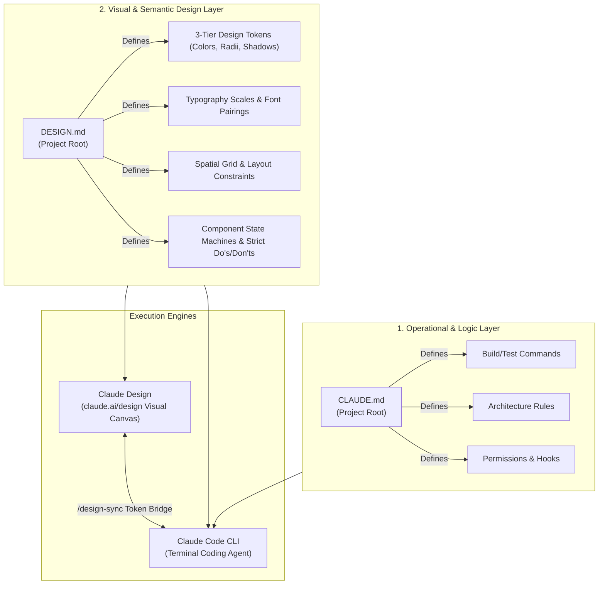
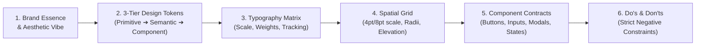
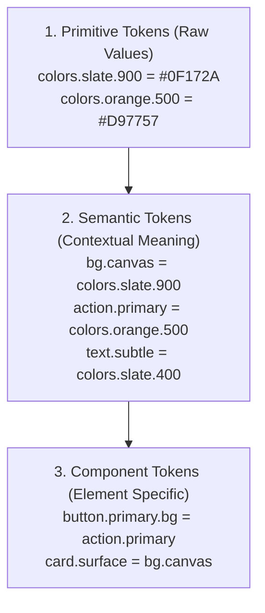
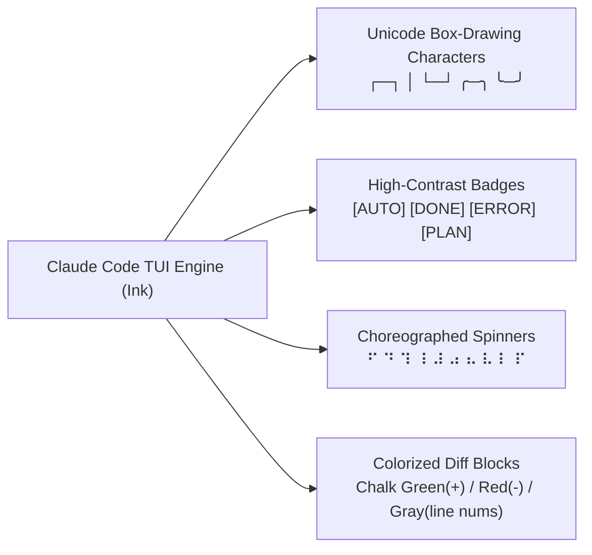
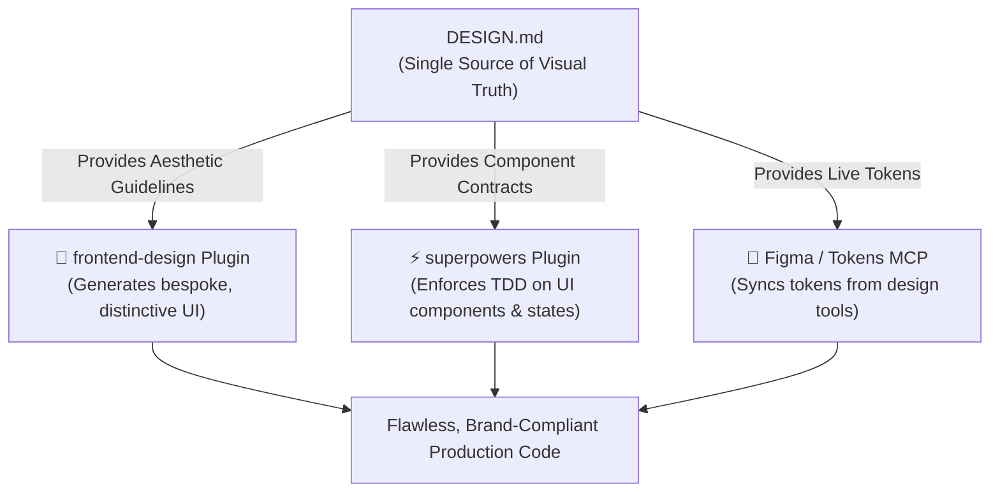

# Claude Code Design System & DESIGN.md Specification Guide

> **Ecosystem**: Claude Code CLI + Claude Design (`claude.ai/design`)  
> **Standard File**: `DESIGN.md` (Project Visual & Semantic Contract)  
> **Core Objective**: Eliminate generic "AI UI slop" and establish consistent, production-grade design tokens, typography, spatial systems, and component contracts across all AI-generated code.

---

## 1. Overview & Dual-Engine Design Architecture

Building user interfaces with AI coding assistants frequently suffers from **visual drift** and **generic aesthetics**—often nicknamed *"AI UI Slop"*. Without strict guardrails, models default to repetitive purple gradients, default system fonts, flat rounded cards, and arbitrary padding values.

In the Claude ecosystem, design consistency is maintained through a **dual-engine architecture** powered by two complementary files:



### The Separation of Concerns
| Aspect | `CLAUDE.md` | `DESIGN.md` |
| :--- | :--- | :--- |
| **Primary Scope** | Operational, technical, and architectural instructions. | Visual identity, design tokens, and UI component standards. |
| **Key Directives** | Commands (`npm test`), folder structure, coding rules. | Color palettes, typography scales, spacing grid, component states. |
| **Consumer** | Claude Code CLI & coding agents. | Claude Code CLI, Claude Design canvas, and frontend plugins. |
| **Prompt Syntax** | Loaded automatically into context. | Referenced explicitly (e.g. `Follow @DESIGN.md`). |

---

## 2. The Standard `DESIGN.md` Specification

A production-grade `DESIGN.md` serves as the single source of visual truth. It organizes design decisions into six core tiers:



---

### Tier 1: Brand Essence & Aesthetic Direction
Defines the visual personality of the application. Explicitly chooses an aesthetic direction to prevent bland defaults:

- **Editorial / High-End Luxury**: Serifs, warm parchment neutrals, generous whitespace, subtle micro-motion.
- **Neo-Brutalism**: Hard black borders (`2px solid #000`), high-contrast pastel/vibrant fills, hard drop-shadows with no blur (`4px 4px 0px #000`).
- **Cyberpunk / Dark Telemetry**: Ultra-dark glass surfaces (`#0B0F19`), neon green/cyan glow borders, monospaced tabular data.
- **Modern Kinetic Minimalism**: Nuanced surface elevation, spring physics animations, asymmetrical balance.

---

### Tier 2: 3-Tier Design Tokens

Design tokens are categorized into three hierarchical levels to allow seamless theming and maintainability:



#### Official Anthropic Visual Identity Tokens (Reference Palette)
Anthropic's official brand and Claude interface tokens:

| Token Name | Light Mode | Dark Mode | Usage |
| :--- | :--- | :--- | :--- |
| `color.brand.terracotta` | `#D97757` | `#D97757` | Primary brand accent, CTA highlights, Claude icons |
| `color.bg.canvas` | `#FAF9F5` (Cream/Parchment) | `#141413` (Deep Charcoal) | Base application background |
| `color.bg.surface` | `#FFFFFF` | `#1F1E1D` | Card and modal surface background |
| `color.bg.subtle` | `#E8E6DC` | `#2B2A27` | Subtle element background, hover states |
| `color.text.primary` | `#141413` | `#FAF9F5` | Primary body text and headers |
| `color.text.muted` | `#666560` | `#B0AEA5` | Secondary text, captions, timestamps |
| `color.border.subtle` | `#E8E6DC` | `#33312E` | Card borders, table dividers |
| `color.accent.blue` | `#6A9BCC` | `#7DAEDB` | Information badges, interactive links |
| `color.accent.green` | `#788C5D` | `#8CA070` | Success badges, verified indicators |

---

### Tier 3: Typography Matrix

| Scale Role | Font Family | Size | Weight | Line Height | Tracking |
| :--- | :--- | :--- | :--- | :--- | :--- |
| **Display / Hero** | `Lora`, `Anthropic Serif` | `2.5rem` (40px) | `600` (SemiBold) | `1.1` | `-0.02em` |
| **Heading 1** | `Poppins`, `Anthropic Sans` | `1.875rem` (30px) | `600` (SemiBold) | `1.2` | `-0.01em` |
| **Heading 2** | `Poppins`, `Anthropic Sans` | `1.5rem` (24px) | `600` (SemiBold) | `1.25` | `-0.01em` |
| **Heading 3** | `Poppins`, `Anthropic Sans` | `1.25rem` (20px) | `500` (Medium) | `1.3` | `0` |
| **Body Large** | `Inter`, `Lora` | `1.125rem` (18px) | `400` (Regular) | `1.6` | `0` |
| **Body Regular** | `Inter`, `system-ui` | `1rem` (16px) | `400` (Regular) | `1.5` | `0` |
| **Caption / Badge** | `Inter`, `system-ui` | `0.75rem` (12px) | `500` (Medium) | `1.4` | `+0.02em` |
| **Code / Data** | `JetBrains Mono`, `Anthropic Mono` | `0.875rem` (14px) | `400` / `500` | `1.5` | `0` |

---

### Tier 4: Spatial System, Radii & Shadows

#### 8pt Base Grid Scale
All padding, margin, width, and gap values MUST adhere to multiples of the 4pt/8pt grid:
- `space-1` = `4px`
- `space-2` = `8px`
- `space-3` = `12px`
- `space-4` = `16px`
- `space-6` = `24px`
- `space-8` = `32px`
- `space-12` = `48px`
- `space-16` = `64px`

#### Border Radii Scale
- `radius-sm`: `4px` (Badges, tags, tooltips)
- `radius-md`: `8px` (Buttons, input fields, dropdowns)
- `radius-lg`: `16px` (Cards, panels, modal dialogs)
- `radius-full`: `9999px` (Pill buttons, avatars)

#### Multi-Layer Elevation Shadows (Light & Dark)
```css
/* Elevation 1: Subtle card hover */
--shadow-sm: 0 1px 2px 0 rgba(0, 0, 0, 0.05);

/* Elevation 2: Floating cards, dropdowns */
--shadow-md: 0 4px 6px -1px rgba(0, 0, 0, 0.08), 0 2px 4px -2px rgba(0, 0, 0, 0.04);

/* Elevation 3: Modals, slide-overs */
--shadow-lg: 0 10px 15px -3px rgba(0, 0, 0, 0.1), 0 4px 6px -4px rgba(0, 0, 0, 0.05);
```

---

### Tier 5: Component Contracts & State Machines

Every UI component generated by Claude must support all 6 interactive states:

```mermaid
stateDiagram-v2
    [*] --> Default
    Default --> Hover: Cursor enters
    Hover --> Active: Mouse press / tap
    Active --> Default: Mouse release
    Default --> FocusVisible: Keyboard Tab navigation
    FocusVisible --> Default: Blur
    Default --> Loading: Async action triggered
    Loading --> Default: Success / Done
    Default --> Disabled: Condition not met
```

1. **Default**: Standard visual resting state.
2. **Hover**: Smooth color/scale transition (`duration-150 ease-out`).
3. **Active / Pressed**: Subtle scale reduction (`scale-[0.98]`).
4. **Focus-Visible**: Distinct high-contrast keyboard ring (`ring-2 ring-offset-2 ring-primary`).
5. **Disabled**: Reduced opacity (`opacity-50 pointer-events-none`).
6. **Loading**: Interactive spinner replacing or accompanying icon, maintaining exact component width.

---

### Tier 6: Strict "Do's & Don'ts" (Negative Constraints)

To prevent AI hallucination and style drift, explicit negative constraints are mandatory:

- ❌ **DON'T**: Use arbitrary CSS values like `p-[19px]`, `w-[342px]`, or `text-[#384912]`.
- ❌ **DON'T**: Use default purple/indigo gradients unless explicitly instructed.
- ❌ **DON'T**: Forget `:focus-visible` styling on interactive components.
- ❌ **DON'T**: Hardcode color values in component JSX; always use semantic token classes.
- ✅ **DO**: Support both Light and Dark mode using CSS variables or Tailwind `dark:` variants.
- ✅ **DO**: Ensure WCAG AA minimum 4.5:1 contrast ratio for all text elements.
- ✅ **DO**: Use `tabular-nums` for timestamps, financial figures, and numeric readouts.

---

## 3. Claude Code Terminal TUI (CLI) Design System

Claude Code itself features a distinctive Terminal User Interface (TUI) built with **Ink** (React for CLI). When building CLI plugins, extensions, or developer tools with Claude Code, follow these terminal design patterns:



### Terminal Color & Formatting Tokens
```typescript
import chalk from 'chalk';

export const tuiTheme = {
  brand: chalk.hex('#D97757'),          // Claude Terracotta
  success: chalk.green.bold,            // Passing tests, completed steps
  error: chalk.red.bold,                // Exceptions, failing assertions
  warning: chalk.yellow,                // Deprecations, context warnings
  muted: chalk.gray,                    // Line numbers, secondary logs
  highlight: chalk.cyan,                // File paths, function names
  badge: {
    plan: chalk.bgCyan.black.bold(' PLAN '),
    auto: chalk.bgHex('#D97757').white.bold(' AUTO '),
    done: chalk.bgGreen.black.bold(' DONE '),
    error: chalk.bgRed.white.bold(' FAIL '),
  }
};
```

---

## 4. Complete Production `DESIGN.md` Template

Drop this ready-to-use template into the root of any project:

```markdown
# Project Design System Contract (DESIGN.md)

## 1. Aesthetic Direction & Theme
- **Vibe**: Modern Kinetic Minimalism with Warm Editorial Accents.
- **Theme**: Light & Dark mode supported via CSS custom properties.

## 2. Color Tokens
```css
:root {
  /* Primitives */
  --color-terracotta: #D97757;
  --color-slate-900: #141413;
  --color-slate-100: #FAF9F5;
  --color-slate-200: #E8E6DC;
  --color-slate-400: #B0AEA5;

  /* Semantic - Light Mode */
  --bg-canvas: var(--color-slate-100);
  --bg-surface: #FFFFFF;
  --bg-subtle: var(--color-slate-200);
  --text-primary: var(--color-slate-900);
  --text-muted: #666560;
  --border-subtle: var(--color-slate-200);
  --primary: var(--color-terracotta);
  --primary-hover: #C56747;
}

.dark {
  /* Semantic - Dark Mode */
  --bg-canvas: var(--color-slate-900);
  --bg-surface: #1F1E1D;
  --bg-subtle: #2B2A27;
  --text-primary: var(--color-slate-100);
  --text-muted: var(--color-slate-400);
  --border-subtle: #33312E;
  --primary: var(--color-terracotta);
  --primary-hover: #E2886B;
}
```

## 3. Typography
- **Headings**: `Poppins`, sans-serif (Weights: 600, 700)
- **Body Text**: `Inter`, sans-serif (Weights: 400, 500)
- **Editorial Accents**: `Lora`, serif (Weights: 400 italic, 600)
- **Monospace/Numbers**: `JetBrains Mono`, monospace (font-feature-settings: 'tnum')

## 4. Spacing & Sizing
- Strictly follow the 4pt/8pt grid: `4px`, `8px`, `12px`, `16px`, `24px`, `32px`, `48px`, `64px`.
- Card border radius: `12px` (`rounded-xl`).
- Button border radius: `8px` (`rounded-lg`).

## 5. Component Rules
- **Buttons**: Must include `:hover`, `:active (scale-98)`, `:focus-visible`, and disabled states.
- **Inputs**: High-contrast focus rings (`focus-visible:ring-2 focus-visible:ring-primary`).
- **Cards**: Surface background with subtle border (`border border-subtle bg-surface shadow-sm`).

## 6. Constraints (Do's & Don'ts)
- NEVER use arbitrary pixel margins or colors (`p-[13px]`, `bg-[#333]`).
- NEVER remove focus indicators.
- ALWAYS test WCAG AA 4.5:1 contrast on all text elements.
```

---

## 5. Tailwind CSS Configuration Mappings

### Tailwind CSS v3 Configuration (`tailwind.config.ts`)
```typescript
import type { Config } from 'tailwindcss';

const config: Config = {
  darkMode: 'class',
  content: ['./src/**/*.{js,ts,jsx,tsx,mdx}'],
  theme: {
    extend: {
      colors: {
        canvas: 'var(--bg-canvas)',
        surface: 'var(--bg-surface)',
        subtle: 'var(--bg-subtle)',
        primary: {
          DEFAULT: 'var(--primary)',
          hover: 'var(--primary-hover)',
        },
        border: 'var(--border-subtle)',
      },
      textColor: {
        primary: 'var(--text-primary)',
        muted: 'var(--text-muted)',
      },
      fontFamily: {
        sans: ['Poppins', 'Inter', 'sans-serif'],
        serif: ['Lora', 'serif'],
        mono: ['JetBrains Mono', 'monospace'],
      },
    },
  },
  plugins: [],
};

export default config;
```

### Tailwind CSS v4 Configuration (`globals.css`)
```css
@import "tailwindcss";

@theme {
  --color-canvas: var(--bg-canvas);
  --color-surface: var(--bg-surface);
  --color-subtle: var(--bg-subtle);
  --color-primary: var(--primary);
  --color-primary-hover: var(--primary-hover);
  --color-border: var(--border-subtle);

  --font-sans: 'Poppins', 'Inter', sans-serif;
  --font-serif: 'Lora', serif;
  --font-mono: 'JetBrains Mono', monospace;
}
```

---

## 6. Synergy with Claude Code Plugins



1. **`DESIGN.md` + `frontend-design` Plugin**: Claude Code reads `DESIGN.md` to ensure generated templates strictly follow your brand typography and color tokens rather than generic styles.
2. **`DESIGN.md` + `superpowers` Plugin**: Superpowers uses the component states defined in `DESIGN.md` (default, hover, loading, disabled) to generate comprehensive unit tests and Storybook fixtures.
3. **`DESIGN.md` + MCP Servers**: Synchronize Figma variables directly into `DESIGN.md` using the Figma Model Context Protocol server.
