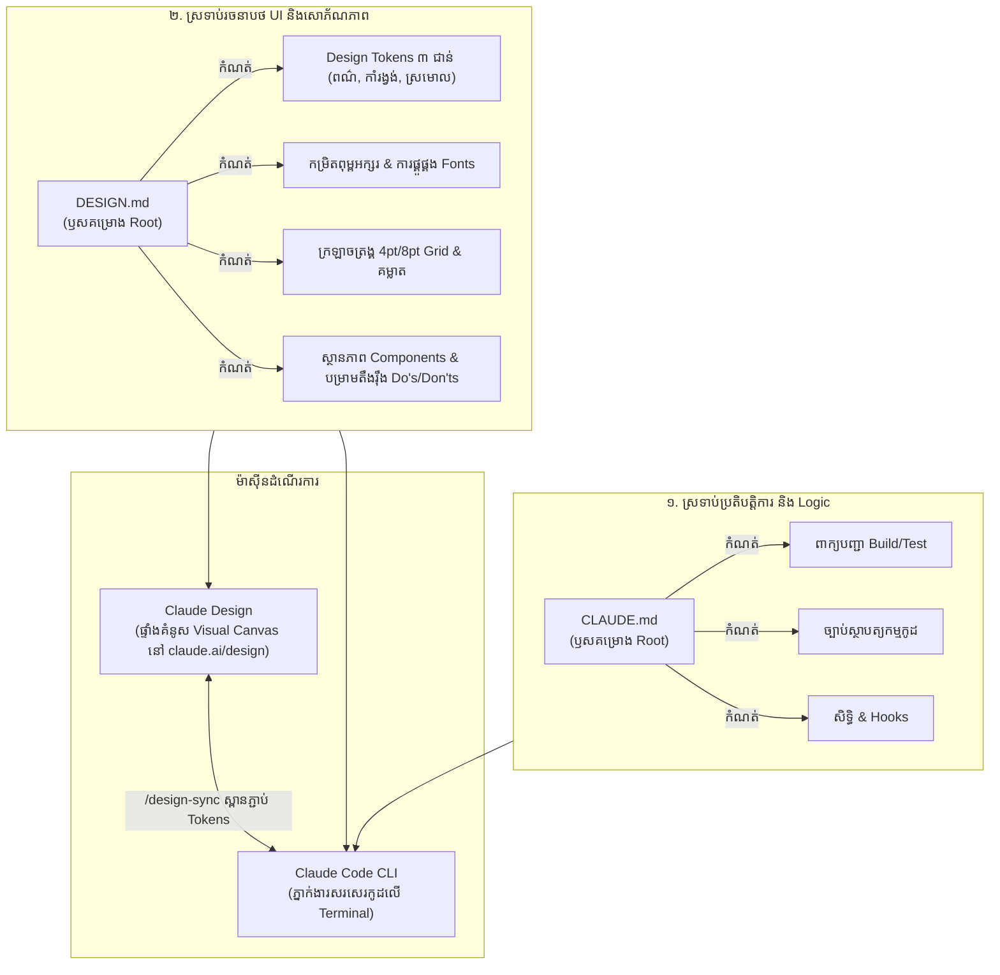
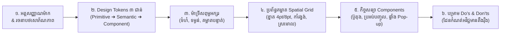
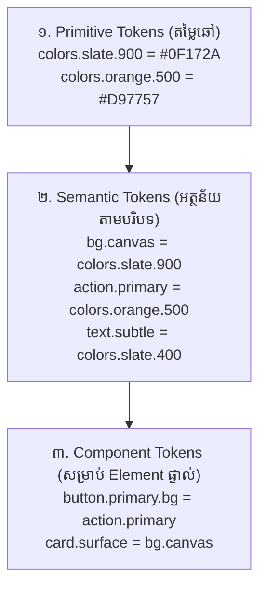
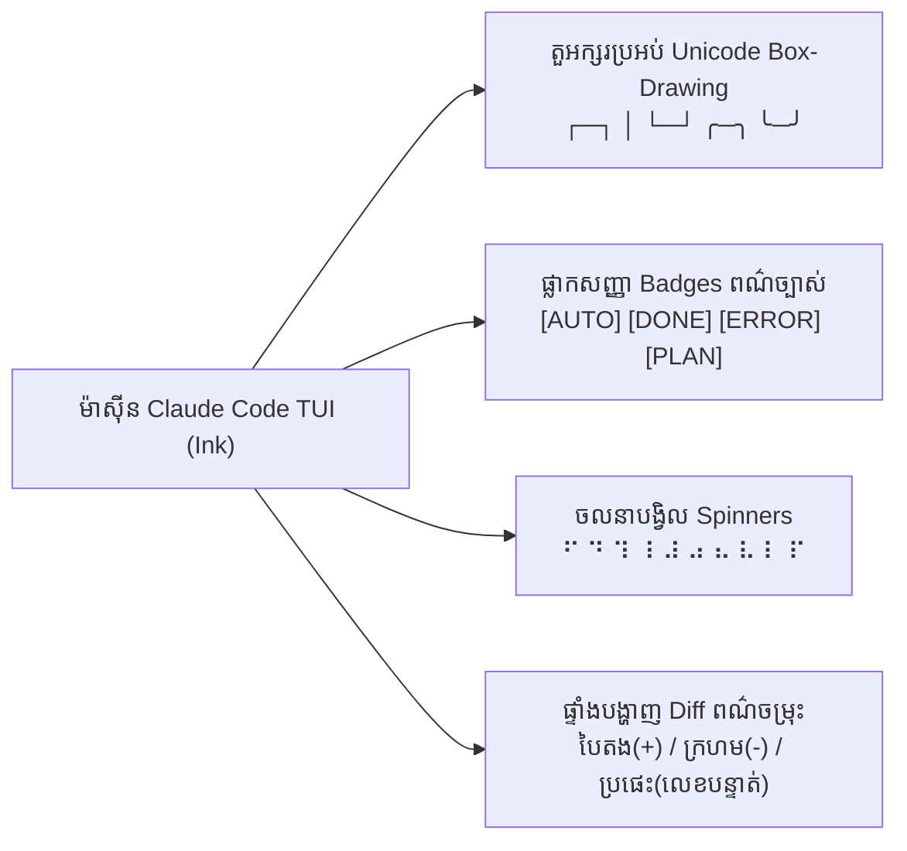
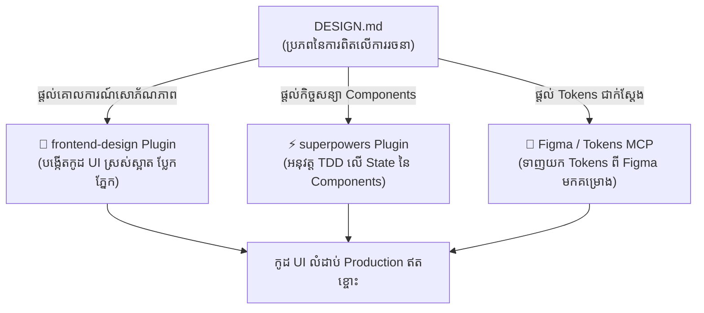

# សៀវភៅណែនាំ Claude Code Design System & កិច្ចសន្យា DESIGN.md (ភាសាខ្មែរ)

> **ប្រព័ន្ធដំណើរការ**: Claude Code CLI + Claude Design (`claude.ai/design`)  
> **ឯកសារស្តង់ដារ**: `DESIGN.md` (កិច្ចសន្យារចនាបថ និងប្រព័ន្ធ UI នៃគម្រោង)  
> **គោលបំណងចម្បង**: លុបបំបាត់រចនាបថ UI បែប AI ដដែលៗ (ហៅថា *"AI UI Slop"*) និងបង្កើតកូដ UI/UX លំដាប់ Production ស្រស់ស្អាត តាមរយៈ Design Tokens, ប្រព័ន្ធពុម្ពអក្សរ, Spatial Grid និងច្បាប់កម្រិត Element។

---

## ១. សេចក្តីផ្តើម និងស្ថាបត្យកម្មរចនាបថ Dual-Engine

ការបង្កើត User Interface ជាមួយជំនួយការសរសេរកូដ AI ជាទូទៅតែងតែជួបប្រទះបញ្ហា **ភាពរសាត់នៃរចនាបថ (Visual Drift)** និង **UI ដដែលៗគ្មានភាពទាក់ទាញ** (ហៅថា *"AI UI Slop"*)។ ប្រសិនបើគ្មានក្របខ័ណ្ឌរារាំងច្បាស់លាស់ទេ AI នឹងបង្កើត UI ដែលប្រើពណ៌ Gradient ស្វាយដដែលៗ, ពុម្ពអក្សរ System Font ធម្មតា, Card រាងមូលសំប៉ែត និងគម្លាត Padding តាមតែចិត្ត។

នៅក្នុងប្រព័ន្ធ Claude ភាពស៊ីសង្វាក់គ្នានៃការរចនាត្រូវបានធានាតាមរយៈ **ស្ថាបត្យកម្ម Dual-Engine** ដែលដំណើរការដោយឯកសារគោលចំនួនពីរ៖



### ការបែងចែកតួនាទីរវាង `CLAUDE.md` និង `DESIGN.md`
| ចំណុចប្រៀបធៀប | `CLAUDE.md` | `DESIGN.md` |
| :--- | :--- | :--- |
| **វិសាលភាពចម្បង** | ការណែនាំប្រតិបត្តិការ បច្ចេកទេស និងស្ថាបត្យកម្មកូដ។ | អត្តសញ្ញាណរចនាបថ, Design Tokens និងស្តង់ដារ UI។ |
| **ខ្លឹមសារស្នូល** | ពាក្យបញ្ជា (`npm test`), រចនាសម្ព័ន្ធ Folder, ច្បាប់កូដ។ | ក្ដារពណ៌, ខ្នាតពុម្ពអក្សរ, ប្រព័ន្ធគម្លាត, ស្ថានភាពប៊ូតុង។ |
| **អ្នកប្រើប្រាស់** | Claude Code CLI និងភ្នាក់ងារសរសេរកូដ។ | Claude Code CLI, ផ្ទាំង Claude Design និង Frontend Plugins។ |
| **របៀបហៅប្រើ** | ផ្ទុកចូលទៅក្នុង Context ដោយស្វ័យប្រវត្ត។ | ហៅប្រើដោយផ្ទាល់ (ឧ. `អនុវត្តតាម @DESIGN.md`)។ |

---

## ២. បទដ្ឋានកិច្ចសន្យា `DESIGN.md` ស្តង់ដារ (6 Tiers Specification)

ឯកសារ `DESIGN.md` កម្រិត Production ដើរតួជាប្រភពនៃការពិត (Single Source of Truth) ដោយរៀបចំការសម្រេចចិត្តលើការរចនាជា ៦ ជាន់ថ្នាក់៖



---

### ជាន់ទី ១៖ អត្តសញ្ញាណម៉ាក និងទិសដៅរចនាបថ (Aesthetic Direction)
កំណត់បុគ្គលិកលក្ខណៈនៃកម្មវិធី ដើម្បីទប់ស្កាត់ការបង្កើត UI បែប Template សាមញ្ញ៖

- **Editorial / High-End Luxury**៖ ពុម្ពអក្សរ Serif, ផ្ទៃខាងក្រោយពណ៌ក្រដាសបុរាណ (Parchment), គម្លាតធំទូលាយ, ចលនាស្រទន់។
- **Neo-Brutalism**៖ បន្ទាត់ព្រំដែនខ្មៅដិត (`2px solid #000`), ផ្ទៃពណ៌ស្រស់ច្បាស់ (Vibrant Fills), ស្រមោលរឹងគ្មាន Blur (`4px 4px 0px #000`)។
- **Cyberpunk / Dark Telemetry**៖ ផ្ទៃកញ្ចក់ងងឹត (`#0B0F19`), បន្ទាត់ពន្លឺអ៊ីយូតាហ្គាស Neon Green/Cyan, ទិន្នន័យលេខបែប Monospace។
- **Modern Kinetic Minimalism**៖ ស្រមោលស្រទន់ច្រើនស្រទាប់, ចលនាបែប Spring Physics, ភាពស្មើគ្នាបែប Asymmetrical។

---

### ជាន់ទី ២៖ ប្រព័ន្ធ Design Tokens ៣ ជាន់ថ្នាក់

Design Tokens ត្រូវបានរៀបចំជា ៣ កម្រិត ដើម្បីងាយស្រួលក្នុងការផ្លាស់ប្តូរ Theme (Light/Dark) និងថែទាំ៖



#### តារាងពណ៌ផ្លូវការរបស់ Anthropic (Reference Palette)
Tokens ពណ៌ដែលប្រើប្រាស់ក្នុង Claude.ai និង Claude Code Interface៖

| ឈ្មោះ Token | Light Mode | Dark Mode | ការប្រើប្រាស់ |
| :--- | :--- | :--- | :--- |
| `color.brand.terracotta` | `#D97757` | `#D97757` | ពណ៌សម្គាល់ម៉ាក Claude, ចំណុចសំខាន់ CTA, Icon |
| `color.bg.canvas` | `#FAF9F5` (ក្រែម/Parchment) | `#141413` (Charcoal ងងឹត) | ផ្ទៃខាងក្រោយមូលដ្ឋាននៃកម្មវិធី |
| `color.bg.surface` | `#FFFFFF` | `#1F1E1D` | ផ្ទៃខាងក្រោយ Card និង Modal |
| `color.bg.subtle` | `#E8E6DC` | `#2B2A27` | ផ្ទៃខាងក្រោយប៊ូតុងស្រាល, Hover State |
| `color.text.primary` | `#141413` | `#FAF9F5` | អក្សរអត្ថបទគោល និងចំណងជើង |
| `color.text.muted` | `#666560` | `#B0AEA5` | អក្សរបន្ទាប់បន្សំ, Caption, កាលបរិច្ឆេទ |
| `color.border.subtle` | `#E8E6DC` | `#33312E` | បន្ទាត់ព្រំដែន Card, បន្ទាត់ខណ្ឌតារាង |
| `color.accent.blue` | `#6A9BCC` | `#7DAEDB` | Badge ព័ត៌មាន, តំណភ្ជាប់ Interactive Links |
| `color.accent.green` | `#788C5D` | `#8CA070` | Badge ជោគជ័យ, សញ្ញាបញ្ជាក់ភាពត្រឹមត្រូវ |

---

### ជាន់ទី ៣៖ ម៉ាទ្រីសពុម្ពអក្សរ (Typography Matrix)

| តួនាទីទំហំ | ពុម្ពអក្សរ (Font Family) | ទំហំ (Size) | ទម្ងន់ (Weight) | គម្លាតបន្ទាត់ | គម្លាតតួអក្សរ |
| :--- | :--- | :--- | :--- | :--- | :--- |
| **Display / Hero** | `Lora`, `Anthropic Serif` | `2.5rem` (40px) | `600` (SemiBold) | `1.1` | `-0.02em` |
| **Heading 1** | `Poppins`, `Anthropic Sans` | `1.875rem` (30px) | `600` (SemiBold) | `1.2` | `-0.01em` |
| **Heading 2** | `Poppins`, `Anthropic Sans` | `1.5rem` (24px) | `600` (SemiBold) | `1.25` | `-0.01em` |
| **Heading 3** | `Poppins`, `Anthropic Sans` | `1.25rem` (20px) | `500` (Medium) | `1.3` | `0` |
| **Body Large** | `Inter`, `Lora` | `1.125rem` (18px) | `400` (Regular) | `1.6` | `0` |
| **Body Regular** | `Inter`, `system-ui` | `1rem` (16px) | `400` (Regular) | `1.5` | `0` |
| **Caption / Badge** | `Inter`, `system-ui` | `0.75rem` (12px) | `500` (Medium) | `1.4` | `+0.02em` |
| **Code / Data** | `JetBrains Mono`, `Anthropic Mono` | `0.875rem` (14px) | `400` / `500` | `1.5` | `0` |

---

### ជាន់ទី ៤៖ ប្រព័ន្ធគម្លាត Spatial Grid, កាំរង្វង់ & ស្រមោល

#### ក្រឡាចត្រង្គមូលដ្ឋាន 8pt Base Grid
រាល់តម្លៃ Padding, Margin, Width និង Gap ត្រូវតែជាគុណគុណនៃ 4px ឬ 8px៖
- `space-1` = `4px`
- `space-2` = `8px`
- `space-3` = `12px`
- `space-4` = `16px`
- `space-6` = `24px`
- `space-8` = `32px`
- `space-12` = `48px`
- `space-16` = `64px`

#### កម្រិតកាំរង្វង់មូល (Border Radii)
- `radius-sm`៖ `4px` (សម្រាប់ Badges, Tags, Tooltips)
- `radius-md`៖ `8px` (សម្រាប់ Buttons, Inputs, Dropdowns)
- `radius-lg`៖ `16px` (សម្រាប់ Cards, Panels, Modals)
- `radius-full`៖ `9999px` (សម្រាប់ Pill Buttons, Avatars)

#### ស្រមោលច្រើនស្រទាប់ (Elevation Shadows)
```css
/* Elevation 1: ស្រមោលស្រាលលើ Card */
--shadow-sm: 0 1px 2px 0 rgba(0, 0, 0, 0.05);

/* Elevation 2: សម្រាប់ Card អណ្តែត, Dropdowns */
--shadow-md: 0 4px 6px -1px rgba(0, 0, 0, 0.08), 0 2px 4px -2px rgba(0, 0, 0, 0.04);

/* Elevation 3: សម្រាប់ផ្ទាំង Modal, Dialogs */
--shadow-lg: 0 10px 15px -3px rgba(0, 0, 0, 0.1), 0 4px 6px -4px rgba(0, 0, 0, 0.05);
```

---

### ជាន់ទី ៥៖ ស្ថានភាពអន្តរកម្មនៃ Components (6 Interactive States)

រាល់ UI Components ដែលបង្កើតឡើងដោយ Claude ត្រូវតែគាំទ្រស្ថានភាពទាំង ៦ នេះពេញលេញ៖

```mermaid
stateDiagram-v2
    [*] --> Default
    Default --> Hover: ដាក់ Mouse លើ
    Hover --> Active: ចុច Mouse / ប៉ះលើអេក្រង់
    Active --> Default: លែង Mouse វិញ
    Default --> FocusVisible: ចុចគ្រាប់ចុច Tab បញ្ជា
    FocusVisible --> Default: ចាកចេញ (Blur)
    Default --> Loading: កំពុងដំណើរការកិច្ចការ Async
    Loading --> Default: បញ្ចប់ជោគជ័យ
    Default --> Disabled: មិនទាន់បំពេញលក្ខខណ្ឌ
```

1. **Default**៖ រូបរាងធម្មតាពេលគ្មានសកម្មភាព។
2. **Hover**៖ ប្តូរពណ៌ ឬទំហំស្រាលៗដោយរលូន (`duration-150 ease-out`)។
3. **Active / Pressed**៖ រួញទំហំតូចបន្តិចពេលចុច (`scale-[0.98]`)។
4. **Focus-Visible**៖ មានរង្វង់ Highlight ច្បាស់ពេលប្រើ Keyboard Tab (`ring-2 ring-offset-2 ring-primary`)។
5. **Disabled**៖ បន្ថយពន្លឺ និងបិទ Mouse Events (`opacity-50 pointer-events-none`)។
6. **Loading**៖ បង្ហាញ Spinner បង្វិលជំនួស Icon ដោយរក្សាទទឹង Component ឱ្យនៅថេរដដែល។

---

### ជាន់ទី ៦៖ បម្រាមតឹងរ៉ឹង Do's & Don'ts (Negative Constraints)

- ❌ **ហាមដាច់ខាត**៖ ប្រើប្រាស់ខ្នាត Pixel តាមតែចិត្តដូចជា `p-[19px]`, `w-[342px]`, ឬ `text-[#384912]`។
- ❌ **ហាមដាច់ខាត**៖ ប្រើពណ៌ Gradient ស្វាយដដែលៗ ប្រសិនបើគ្មានការស្នើសុំជាក់លាក់។
- ❌ **ហាមដាច់ខាត**៖ លុបចោលសញ្ញា `:focus-visible` នៅលើប៊ូតុង ឬតំណភ្ជាប់។
- ❌ **ហាមដាច់ខាត**៖ សរសេរកូដពណ៌រឹង (Hardcoded Hex) ក្នុង Component JSX; ត្រូវប្រើ Semantic Class ជានិច្ច។
- ✅ **ត្រូវតែធ្វើ**៖ គាំទ្រទាំង Light Mode និង Dark Mode ដោយប្រើ CSS Variables ឬ Tailwind `dark:` variants។
- ✅ **ត្រូវតែធ្វើ**៖ ធានាថាកម្រិត Contrast នៃអក្សរជាប់ស្តង់ដារ WCAG AA 4.5:1 ជាអប្បបរមា។
- ✅ **ត្រូវតែធ្វើ**៖ ប្រើប្រាស់ `tabular-nums` សម្រាប់ទិន្នន័យលេខ ម៉ោង និងតួលេខហិរញ្ញវត្ថុ។

---

## ៣. ស្ថាបត្យកម្មរចនាបថ Claude Code Terminal TUI (CLI)

Claude Code CLI មានចំណុចប្រទាក់ Terminal ស្រស់ស្អាត ប្លែកពីគេ ដែលត្រូវបានបង្កើតឡើងដោយប្រើ **Ink** (React សម្រាប់ CLI)៖



### កូដកំណត់ពណ៌ Theme សម្រាប់ Terminal (TypeScript + Chalk)
```typescript
import chalk from 'chalk';

export const tuiTheme = {
  brand: chalk.hex('#D97757'),          // ពណ៌ទឹកក្រូច Claude Terracotta
  success: chalk.green.bold,            // តេស្ត Pass, ជំហានជោគជ័យ
  error: chalk.red.bold,                // កំហុស Error, បរាជ័យ
  warning: chalk.yellow,                // ការព្រមាន Warning, Deprecations
  muted: chalk.gray,                    // លេខបន្ទាត់កូដ, Log បន្ទាប់បន្សំ
  highlight: chalk.cyan,                // ផ្លូវ File, ឈ្មោះ Function
  badge: {
    plan: chalk.bgCyan.black.bold(' PLAN '),
    auto: chalk.bgHex('#D97757').white.bold(' AUTO '),
    done: chalk.bgGreen.black.bold(' DONE '),
    error: chalk.bgRed.white.bold(' FAIL '),
  }
};
```

---

## ៤. គំរូឯកសារ `DESIGN.md` ពេញលេញសម្រាប់គម្រោង

អ្នកអាចចម្លងគំរូខាងក្រោមនេះទៅដាក់ក្នុង Folder គម្រោងរបស់អ្នកជា `DESIGN.md`៖

```markdown
# កិច្ចសន្យាប្រព័ន្ធរចនាគម្រោង (DESIGN.md)

## ១. ទិសដៅរចនាបថ និងស្បែកពណ៌ (Aesthetic Direction)
- **ទម្រង់**: Modern Kinetic Minimalism រួមផ្សំជាមួយរចនាបថ Warm Editorial។
- **ការគាំទ្រ**: គាំទ្រទាំង Light Mode និង Dark Mode តាមរយៈ CSS Custom Properties។

## ២. ប្រព័ន្ធពណ៌ (Color Tokens)
```css
:root {
  /* Primitive Tokens */
  --color-terracotta: #D97757;
  --color-slate-900: #141413;
  --color-slate-100: #FAF9F5;
  --color-slate-200: #E8E6DC;
  --color-slate-400: #B0AEA5;

  /* Semantic - Light Mode */
  --bg-canvas: var(--color-slate-100);
  --bg-surface: #FFFFFF;
  --bg-subtle: var(--color-slate-200);
  --text-primary: var(--color-slate-900);
  --text-muted: #666560;
  --border-subtle: var(--color-slate-200);
  --primary: var(--color-terracotta);
  --primary-hover: #C56747;
}

.dark {
  /* Semantic - Dark Mode */
  --bg-canvas: var(--color-slate-900);
  --bg-surface: #1F1E1D;
  --bg-subtle: #2B2A27;
  --text-primary: var(--color-slate-100);
  --text-muted: var(--color-slate-400);
  --border-subtle: #33312E;
  --primary: var(--color-terracotta);
  --primary-hover: #E2886B;
}
```

## ៣. ប្រព័ន្ធពុម្ពអក្សរ (Typography)
- **ចំណងជើង (Headings)**: `Poppins`, sans-serif (ទម្ងន់: 600, 700)
- **តួអត្ថបទ (Body)**: `Inter`, sans-serif (ទម្ងន់: 400, 500)
- **អក្សរបែប Editorial**: `Lora`, serif (ទម្ងន់: 400 italic, 600)
- **លេខ និងកូដ (Monospace)**: `JetBrains Mono`, monospace (font-feature-settings: 'tnum')

## ៤. ប្រព័ន្ធគម្លាត និងទំហំ (Spacing & Sizing)
- ត្រូវតែអនុវត្តតាមខ្នាត 4pt/8pt យ៉ាងតឹងរ៉ឹង៖ `4px`, `8px`, `12px`, `16px`, `24px`, `32px`, `48px`, `64px`។
- កាំរង្វង់ Card៖ `12px` (`rounded-xl`)។
- កាំរង្វង់ Button៖ `8px` (`rounded-lg`)។

## ៥. ច្បាប់អនុវត្តលើ Components
- **Buttons**: ត្រូវតែមាន `:hover`, `:active (scale-98)`, `:focus-visible`, និង Disabled State។
- **Inputs**: ត្រូវតែមានរង្វង់ Focus ច្បាស់ (`focus-visible:ring-2 focus-visible:ring-primary`)។
- **Cards**: ផ្ទៃខាងក្រោយ Surface ជាមួយបន្ទាត់ព្រំដែនស្រាល (`border border-subtle bg-surface shadow-sm`)។

## ៦. បម្រាមតឹងរ៉ឹង (Do's & Don'ts)
- ហាមដាច់ខាតមិនឱ្យប្រើប្រាស់ Pixel តាមចិត្ត (`p-[13px]`, `bg-[#333]`)។
- ហាមដាច់ខាតមិនឱ្យលុបចោល Focus Ring។
- ត្រូវតែធានាស្តង់ដារ WCAG AA 4.5:1 Contrast ជានិច្ច។
```

---

## ៥. ការកំណត់រចនាសម្ព័ន្ធជាមួយ Tailwind CSS

### សម្រាប់ Tailwind CSS v3 (`tailwind.config.ts`)
```typescript
import type { Config } from 'tailwindcss';

const config: Config = {
  darkMode: 'class',
  content: ['./src/**/*.{js,ts,jsx,tsx,mdx}'],
  theme: {
    extend: {
      colors: {
        canvas: 'var(--bg-canvas)',
        surface: 'var(--bg-surface)',
        subtle: 'var(--bg-subtle)',
        primary: {
          DEFAULT: 'var(--primary)',
          hover: 'var(--primary-hover)',
        },
        border: 'var(--border-subtle)',
      },
      textColor: {
        primary: 'var(--text-primary)',
        muted: 'var(--text-muted)',
      },
      fontFamily: {
        sans: ['Poppins', 'Inter', 'sans-serif'],
        serif: ['Lora', 'serif'],
        mono: ['JetBrains Mono', 'monospace'],
      },
    },
  },
  plugins: [],
};

export default config;
```

---

## ៦. ការរួមផ្សំជាមួយ Plugins ដទៃទៀត



1. **`DESIGN.md` + `frontend-design` Plugin**៖ Claude Code អាន `DESIGN.md` ដើម្បីធានាថាកូដ UI ដែលបង្កើតឡើងអនុវត្តតាមក្ដារពណ៌ និងពុម្ពអក្សរជាក់លាក់របស់ Brand មិនមែនស្ទីល Generic ឡើយ។
2. **`DESIGN.md` + `superpowers` Plugin**៖ Superpowers យកស្ថានភាព Component ដែលបានកំណត់ក្នុង `DESIGN.md` (Default, Hover, Loading, Disabled) មកបង្កើតជា Unit Test និង Storybook Fixture ស្វ័យប្រវត្ត។
3. **`DESIGN.md` + MCP Servers**៖ ធ្វើសមកាលកម្មទិន្នន័យ (Sync) ពី Figma Variables មកកាន់ `DESIGN.md` ដោយផ្ទាល់តាមរយៈ Figma Model Context Protocol Server។
