# Frontend Design Plugin Guide for Claude Code

> **Plugin**: `frontend-design` (Anthropic Verified)  
> **Marketplace**: [https://claude.com/marketplace/plugins/frontend-design](https://claude.com/marketplace/plugins/frontend-design)  
> **Source Repository**: [anthropics/claude-plugins-official](https://github.com/anthropics/claude-plugins-official/tree/main/plugins/frontend-design)  
> **Installs**: 1.1M+

---

## 1. Overview & Purpose

The **Frontend Design** plugin transforms Claude Code from a general coding assistant into a **world-class UI/UX designer and frontend engineer**.

Traditional AI coding assistants often generate bland, cookie-cutter interfaces: default system sans-serif fonts, clichéd purple/indigo gradients, standard rounded cards, and flat animations. The **Frontend Design** plugin completely changes this dynamic by enforcing **distinctive, production-grade visual design** and establishing clear design frameworks before writing a single line of code.

```mermaid
flowchart TD
    subgraph TraditionalAI ["Generic AI Code Generation"]
        A1["Prompt: 'Build a dashboard'"] --> A2["Default Inter / Roboto Font"]
        A2 --> A3["Generic Purple Gradients & Rounded Cards"]
        A3 --> A4["Boring, Template-looking UI"]
    end

    subgraph FrontendDesignPlugin ["With frontend-design Plugin"]
        B1["Prompt: 'Build a dashboard'"] --> B2["1. Establish Aesthetic Direction<br>(Brutalist, Luxury, Cyberpunk, Neo-Minimalist)"]
        B2 --> B3["2. Intentional Typography & Color Palettes<br>(Curated Serif + Mono + High-Contrast Accents)"]
        B3 --> B4["3. Spatial Depth & Fluid Motion<br>(Glassmorphism, Asymmetry, Keyframe Animations)"]
        B4 --> B5["Distinctive, Award-Winning Production UI"]
    end
```



---

## 2. Installation & Management

### Install via Claude Code CLI
Run the official marketplace install command in your terminal:

```bash
claude plugin install frontend-design@claude-plugins-official
```

### Verify and Reload
Inside an active Claude Code session:
- Check loaded plugins:
  ```text
  /plugin
  ```
- Reload plugins after updating:
  ```text
  /reload-plugins
  ```

Once installed, the plugin **activates automatically** whenever you ask Claude to create, refactor, or design user interfaces, web components, landing pages, or dashboards.

---

## 3. Core Design Principles Enforced by the Plugin

The plugin instructs Claude to operate according to five fundamental design pillars:

### A. Intentional Aesthetic Direction
Before generating components, Claude establishes a specific aesthetic identity tailored to your product's domain:
- **Neo-Brutalism**: Bold black borders, vibrant contrasting fills, raw structural grids, monospaced data readouts.
- **High-End Luxury / Editorial**: Refined serif headings, subtle warm neutral backgrounds, generous whitespace, understated micro-animations.
- **Cyberpunk / Retro-Futuristic**: Dark glass surfaces, glowing borders, monospaced telemetry, terminal-style toggles.
- **Modern Kinetic Minimalism**: Ultra-smooth spring animations, asymmetric balance, crisp typography, nuanced shadow layering.
- **Playful & Tactile**: Bouncy interactions, rounded claymorphism, vibrant expressive colors.

### B. Anti-Generic Typography
- Banned: Defaulting to generic system fonts (`Inter`, `system-ui`) for everything.
- Enforced: High-character font pairings combining expressive display fonts, elegant editorial serifs, and high-readability body typography with technical monospaced accents.

### C. Visual Depth & Spatial Composition
- Replaces flat rectangular grids with **asymmetrical layouts**, overlapping cards, staggered content columns, and dynamic negative space.
- Implements rich layered effects: blurred glass backdrops (`backdrop-blur-md`), ambient colored glows, subtle textured noise, and multi-layered drop shadows.

### D. Orchestrated Motion & Micro-Interactions
- Smooth CSS transition curves (`cubic-bezier(0.16, 1, 0.3, 1)`).
- Scroll-triggered reveal animations and staggered entrance effects.
- Tactile hover and active states (scale bumps, glowing ring expansions, subtle perspective tilting).

### E. Production-Grade Accessibility & Responsiveness
- Fully compliant with WCAG color contrast ratios.
- Full keyboard navigability (`:focus-visible` ring styling).
- Native dark mode and high-density responsive layout adaptations (Mobile ➔ Tablet ➔ Ultra-Wide).

---

## 4. Practical Prompt Library & Examples

When the `frontend-design` plugin is active, you can provide concise prompts and receive stunning, ready-to-run code.

### Example 1: SaaS Analytics Dashboard
```text
> Build a real-time cybersecurity telemetry dashboard in React and Tailwind CSS.
  Aesthetic: Dark cyber-ops theme with glowing green/cyan data visualizations,
  threat alert feeds with pulsing badges, and an interactive system load monitor.
```

### Example 2: High-Converting Landing Page
```text
> Create an editorial-style landing page for an artisan coffee roastery.
  Include an interactive brew method selector, roast profile slider,
  generous typography with serif headers, and subtle scroll-triggered fade-ins.
```

### Example 3: Music Streaming App Interface
```text
> Design a music streaming web player with an audio visualizer wave,
  frosted glass playlist drawer, album art color extraction background glow,
  and tactile play/pause micro-interactions.
```

### Example 4: Settings & Preferences Console
```text
> Build a developer settings modal in Next.js with dark/light mode toggle,
  API key masking with one-click copy feedback, granular permission checkboxes,
  and smooth tab switching animations.
```

---

## 5. Supported Frameworks & Styling Technologies

The plugin generates clean, modern code optimized for your choice of frontend stack:

| Technology | Support Level | Features |
| :--- | :--- | :--- |
| **React / Next.js** | Native | Server components, Framer Motion integration, Lucide/Heroicons, Tailwind CSS. |
| **Tailwind CSS (v3 / v4)** | Native | Custom utility classes, CSS variables, `@keyframes`, arbitrary values. |
| **Vue 3 / Nuxt** | Native | Single-file components (`<script setup>`), Tailwind / UnoCSS. |
| **Svelte / SvelteKit** | Native | Reactive spring stores, built-in transitions (`fade`, `fly`, `slide`). |
| **HTML5 / Modern CSS** | Native | CSS Grid, Flexbox, CSS Custom Properties, Subgrid, `@container` queries. |

---

## 6. Best Practices when Designing with Claude Code

1. **Specify the Mood or Audience**: Give Claude a hint about the intended vibe (e.g. *"industrial brutalism"*, *"Swiss typography style"*, or *"luxury fintech"*).
2. **Mention Target Frameworks**: Specify if you prefer Tailwind CSS, CSS Modules, or specific animation libraries (like Framer Motion).
3. **Iterate Verbally**: Refine specific aspects without restarting:
   - *"Make the typography feel bolder and increase the whitespace around the hero section."*
   - *"Add smooth hover animations to all interactive cards."*
4. **Inspect in Browser**: Combine with the Claude Desktop app or local dev server to immediately preview and fine-tune your frontend creations.
