# សៀវភៅណែនាំ Frontend Design Plugin សម្រាប់ Claude Code (ភាសាខ្មែរ)

> **Plugin**: `frontend-design` (ផ្ទៀងផ្ទាត់ផ្លូវការដោយ Anthropic Verified)  
> **Marketplace**: [https://claude.com/marketplace/plugins/frontend-design](https://claude.com/marketplace/plugins/frontend-design)  
> **Source Repository**: [anthropics/claude-plugins-official](https://github.com/anthropics/claude-plugins-official/tree/main/plugins/frontend-design)  
> **ចំនួនអ្នកដំឡើង (Installs)**: លើសពី ១.១ លាននាក់ (1.1M+)

---

## ១. សេចក្តីផ្តើម និងគោលបំណង

Plugin **Frontend Design** ផ្លាស់ប្តូរ Claude Code ពីជំនួយការសរសេរកូដទូទៅ ឱ្យក្លាយទៅជា **អ្នករចនា UI/UX និងវិស្វករ Frontend កម្រិតពិភពលោក**។

ជំនួយការ AI ជំនាន់មុនៗភាគច្រើនតែងតែបង្កើតផ្ទាំង UI បែបសាមញ្ញ ដដែលៗ និងគ្មានភាពទាក់ទាញ (ដូចជាការប្រើ Font ស្តង់ដារធម្មតា ពណ៌ Gradient ស្វាយដដែលៗ និង Card រាងមូលគំរូចាស់ៗ)។ Plugin **Frontend Design** ជួយលុបបំបាត់ភាពដដែលៗទាំងនេះ ដោយកំណត់ឱ្យ Claude បង្កើតកូដ UI ដែលមាន **សោភ័ណភាពទាក់ទាញ ភាពច្នៃប្រឌិតខ្ពស់ និងរចនាបថកម្រិត Production ជាក់ស្តែង** មុននឹងចាប់ផ្តើមសរសេរកូដ។

```mermaid
flowchart TD
    subgraph TraditionalAI ["AI សរសេរកូដទូទៅ (គ្មាន Plugin)"]
        A1["Prompt: 'បង្កើត Dashboard មួយ'"] --> A2["ប្រើ Font Inter / Roboto ធម្មតា"]
        A2 --> A3["Gradient ស្វាយសាមញ្ញ & Card រាងមូលដដែលៗ"]
        A3 --> A4["UI មើលទៅដូច Template ទូទៅ គ្មានចំណុចទាក់ទាញ"]
    end

    subgraph FrontendDesignPlugin ["ប្រើប្រាស់ជាមួយ frontend-design Plugin"]
        B1["Prompt: 'បង្កើត Dashboard មួយ'"] --> B2["១. កំណត់ទិសដៅសោភ័ណភាពច្បាស់លាស់<br>(Brutalist, Luxury, Cyberpunk, Neo-Minimalist)"]
        B2 --> B3["២. រៀបចំ Font & ពណ៌ឱ្យស៊ីគ្នា និងមានកម្រិត Contrast ខ្ពស់<br>(Serif + Mono + បន្សំពណ៌ពិសេស)"]
        B3 --> B4["៣. បន្ថែមជម្រៅ និងចលនាទាក់ទាញ<br>(Glassmorphism, Asymmetry, Keyframe Animations)"]
        B4 --> B5["ទទួលបាន UI លំដាប់ Production ស្រស់ស្អាតប្លែកគេ"]
    end
```



---

## ២. របៀបដំឡើង និងការគ្រប់គ្រង (Installation)

### ដំឡើងតាមរយៈ Claude Code CLI
វាយពាក្យបញ្ជាផ្លូវការពី Marketplace ក្នុង Terminal របស់អ្នក៖

```bash
claude plugin install frontend-design@claude-plugins-official
```

### ពិនិត្យមើល និង Refresh Plugin ឡើងវិញ
នៅពេលកំពុងដំណើរការ Claude Code៖
- ពិនិត្យបញ្ជី Plugin ដែលបានផ្ទុក៖
  ```text
  /plugin
  ```
- ដំណើរការ Plugin ឡើងវិញពេលមាន Update៖
  ```text
  /reload-plugins
  ```

នៅពេលដំឡើងរួចរាល់ Plugin នេះនឹង **ដំណើរការដោយស្វ័យប្រវត្តិ** រាល់ពេលដែលអ្នកប្រាប់ Claude ឱ្យបង្កើត កែកូដ ឬរចនា Web Component, Dashboard, Landing Page ឬ Mobile App UI។

---

## ៣. គោលការណ៍រចនាស្នូលដែល Plugin នេះអនុវត្ត

Plugin នេះបានបង្កប់នូវគោលការណ៍រចនាធំៗចំនួន ៥៖

### ក. ការកំណត់ទិសដៅសោភ័ណភាពឱ្យស៊ីនឹងផលិតផល (Aesthetic Direction)
មុននឹងសរសេរកូដ Claude នឹងជ្រើសរើសស្ទីលរចនាឱ្យសមស្របតាមប្រភេទផលិតផលរបស់អ្នក៖
- **Neo-Brutalism**៖ ស៊ុមពណ៌ខ្មៅដិតៗ, ពណ៌ផ្ទៃកម្រិត Contrast ខ្ពស់, Grid បែប Industrial, Font Monospace បង្ហាញទិន្នន័យ។
- **High-End Luxury / Editorial**៖ ចំណងជើងបែប Serif ស្រស់ស្អាត, ផ្ទៃខាងក្រោយពណ៌ស្រទន់បែប Neutral, គម្លាត Whitespace ទូលាយ, ចលនា Micro-animation ស្រាលៗ។
- **Cyberpunk / Retro-Futuristic**៖ កញ្ចក់ថ្លាជះពន្លឺ (Glassmorphism), ស៊ុមភ្លឺបែប Neon/Cyan, ផ្ទាំងទិន្នន័យបែប Terminal Hacker។
- **Modern Kinetic Minimalism**៖ ចលនាទន់ភ្លន់បែប Spring Animation, ការរៀបចំ Layout អតុល្យភាពបែបសិល្បៈ (Asymmetry), ស្រមោលពន្លឺច្រើនជាន់។
- **Playful & Tactile**៖ ប៊ូតុងរាងមូលបែប 3D Claymorphism, អន្តរកម្មលោតចុះឡើងទាក់ទាញ, ពណ៌ស្រស់ឆើតឆាយ។

### ខ. ការជ្រើសរើស Font និងអក្សរសិល្ប៍ (Distinctive Typography)
- **ហាមដាច់ខាត**៖ ការប្រើ Font លំនាំដើមតែមួយមុខសម្រាប់អ្វីៗគ្រប់យ៉ាង (`Inter`, `system-ui`)។
- **អនុវត្ត**៖ ផ្សំពណ៌ និង Font ប្លែកៗគ្នា ដូចជាការប្រើ Serif សម្រាប់ Heading ធំៗ + Sans-serif សម្រាប់អត្ថបទធម្មតា + Monospace សម្រាប់ទិន្នន័យបច្ចេកទេស។

### គ. ការបង្កើតជម្រៅ និងទម្រង់ Layout (Spatial Depth)
- ជំនួសការតម្រៀបប្រអប់ការ៉េសាមញ្ញ ដោយការប្រើ **Asymmetrical Grid**, កាតជាន់លើគ្នា (Overlapping Cards) និងការទុកគម្លាតសមស្រប។
- ប្រើប្រាស់បែបផែនកម្រិតខ្ពស់៖ ផ្ទៃកញ្ចក់ព្រាល (`backdrop-blur-md`), ពន្លឺជះជុំវិញ (Ambient Glows), ស្រទាប់ស្រមោលទន់ៗច្រើនជាន់។

### ឃ. ចលនា និងអន្តរកម្មតូចៗ (Motion & Micro-Interactions)
- ប្រើប្រាស់ខ្សែកោងចលនាទន់ភ្លន់ (`cubic-bezier(0.16, 1, 0.3, 1)`)។
- ចលនារំលេចពេល Scroll (Scroll-triggered reveals) និងការបង្ហាញធាតុបន្តកន្ទុយគ្នា (Staggered animations)។
- អន្តរកម្មពេលដាក់ Mouse ពីលើ (Hover states, Scale-up, Glowing rings)។

### ង. ភាពងាយស្រួល និងការឆ្លើយតបគ្រប់អេក្រង់ (Accessibility & Responsive)
- ស្របតាមស្តង់ដារ WCAG (កម្រិតពណ៌ Contrast ងាយអានមិនឈឺភ្នែក)។
- បញ្ជាតាម Keyboard បានពេញលេញ (`:focus-visible` styling)។
- គាំទ្រ Dark Mode ជាប់ជាស្រេច និងការបង្ហាញលើទូរស័ព្ទដៃ ថេប្លេត និងកុំព្យូទ័របានយ៉ាងល្អឥតខ្ចោះ។

---

## ៤. គំរូ Prompts ជាក់ស្តែងសម្រាប់សាកល្បង

នៅពេល Plugin `frontend-design` ដំណើរការ អ្នកគ្រាន់តែប្រាប់គំនិតខ្លីៗ Claude នឹងរៀបចំកូដយ៉ាងប្រណីតជូនអ្នក៖

### ឧទាហរណ៍ ១៖ SaaS Analytics Dashboard
```text
> បង្កើត Dashboard តាមដានទិន្នន័យ Cybersecurity ក្នុង React និង Tailwind CSS។ 
  ស្ទីល៖ Dark Cyber-ops theme ជាមួយក្រាហ្វទិន្នន័យភ្លឺ Neon ពណ៌បៃតង/Cyan, 
  ផ្ទាំង Alert ដែលមាន Badge ភ្លឹបភ្លែតៗ និងឧបករណ៍តាមដាន System Load ផ្ទាល់។
```

### ឧទាហរណ៍ ២៖ ទំព័រ Landing Page ដ៏ទាក់ទាញ
```text
> បង្កើតទំព័រ Landing Page បែប Editorial សម្រាប់ហាងកាហ្វេសិប្បកម្ម (Artisan Coffee)។ 
  រួមបញ្ចូលឧបករណ៍ជ្រើសរើសរបៀបឆុងកាហ្វេ, Slider មើលកម្រិតលីង Roast, 
  ចំណងជើង Serif ប្រណីត និងចលនា Fade-in ពេល Scroll។
```

### ឧទាហរណ៍ ៣៖ កម្មវិធីចាក់ចម្រៀង Music Web Player
```text
> រចនា Music Web Player ដែលមានរលកសំឡេង Audio Visualizer, 
  ផ្ទាំង Playlist បែបកញ្ចក់ព្រាល Frosted Glass, ផ្ទៃ Background ជះពន្លឺតាមពណ៌រូប Album 
  និងប៊ូតុង Play/Pause ដែលមានចលនា Spring Micro-interaction។
```

### ឧទាហរណ៍ ៤៖ ផ្ទាំង Console ការកំណត់ (Settings Panel)
```text
> បង្កើតផ្ទាំង Settings Modal ក្នុង Next.js ដែលមានប៊ូតុងប្តូរ Dark/Light Mode, 
  កន្លែងលាក់ API Key ជាមួយប៊ូតុង Copy ដែលមាន Feedback ពេលចុច, Checkbox កំណត់សិទ្ធិ 
  និងចលនាប្តូរ Tab យ៉ាងរលូន។
```

---

## ៥. បច្ចេកវិទ្យា និង Frameworks ដែលគាំទ្រ

Plugin នេះបង្កើតកូដទំនើប និងស្អាតសម្រាប់ Frontend Stack ពេញនិយមទាំងអស់៖

| បច្ចេកវិទ្យា | កម្រិតគាំទ្រ | លក្ខណៈពិសេស |
| :--- | :--- | :--- |
| **React / Next.js** | ពេញលេញ (Native) | Server Components, Framer Motion, Lucide Icons, Tailwind CSS។ |
| **Tailwind CSS (v3 / v4)** | ពេញលេញ (Native) | Utility Classes, CSS Variables, `@keyframes`, Arbitrary Values។ |
| **Vue 3 / Nuxt** | ពេញលេញ (Native) | `<script setup>`, Tailwind CSS, UnoCSS។ |
| **Svelte / SvelteKit** | ពេញលេញ (Native) | Reactive Stores, បង្កប់ Transitions (`fade`, `fly`, `slide`)។ |
| **HTML5 / Modern CSS** | ពេញលេញ (Native) | CSS Grid, Flexbox, CSS Variables, Subgrid, `@container` Queries។ |

---

## ៦. គន្លឹះល្អៗពេលរចនាជាមួយ Claude Code

1. **បញ្ជាក់អារម្មណ៍ ឬប្រភេទអ្នកប្រើប្រាស់ (Mood/Audience)**៖ ប្រាប់ Claude ពីអារម្មណ៍ដែលចង់បាន (ឧទាហរណ៍៖ *"Industrial Brutalism"*, *"Swiss Typography Minimalist"*, ឬ *"Luxury Fintech"*)។
2. **បញ្ជាក់ Framework ដែលចង់បាន**៖ ប្រាប់ថាអ្នកចង់បាន Tailwind CSS, CSS Modules ឬ Framer Motion។
3. **កែលម្អជាដំណាក់កាល**៖
   - *"សូមធ្វើឱ្យ Font ចំណងជើងដិតជាងមុន និងពង្រីក Whitespace ផ្នែកខាងលើបន្តិច។"*
   - *"សូមបន្ថែមចលនា Hover លើ Card ទាំងអស់។"*
4. **មើលលទ្ធផលជាក់ស្តែង**៖ ដំណើរការ Dev Server លើម៉ាស៊ីន ឬប្រើជាមួយ Claude Desktop App ដើម្បីមើលផ្ទាំង UI ភ្លាមៗ។
