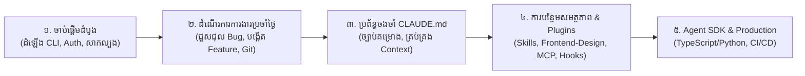

# Claude Code Documentation & Learning Hub
# មជ្ឈមណ្ឌលឯកសារ និងមេរៀន Claude Code

Welcome to the **Claude Code Documentation & Learning Hub**. This repository contains in-depth documentation, tutorials, architecture breakdowns, plugin guides, and quick references in both **English** and **Khmer (ភាសាខ្មែរ)** based on official Anthropic documentation and marketplaces.

---

## 🌐 ភាសាខ្មែរ (Khmer Documentation)

| ឯកសារ | ការពិពណ៌នា |
| :--- | :--- |
| 📖 **[CLAUDE_CODE_GUIDE_KM.md](./CLAUDE_CODE_GUIDE_KM.md)** | **សៀវភៅណែនាំ និងមេរៀនពេញលេញជាភាសាខ្មែរ** មេរៀនលម្អិតទាំង ១០ ផ្នែក រួមមាន ស្ថាបត្យកម្ម ការដំឡើង ដំណើរការការងារប្រចាំថ្ងៃ ប្រព័ន្ធចងចាំ (`CLAUDE.md`) ការបន្ថែមសមត្ថភាព (Skills, Subagents, MCP, Hooks, Plugins) សិទ្ធិ និងសុវត្ថិភាព ការសម្របសម្រួលភ្នាក់ងារច្រើនជាមួយ Git Worktrees និង Claude Agent SDK។ |
| 🎨 **[FRONTEND_DESIGN_PLUGIN_KM.md](./FRONTEND_DESIGN_PLUGIN_KM.md)** | **សៀវភៅណែនាំ Frontend Design Plugin** ការណែនាំលម្អិតអំពី Plugin ផ្លូវការ `frontend-design` (១.១M+ Installs) សម្រាប់បង្កើតកូដ UI/UX លំដាប់ Production ស្រស់ស្អាត ប្លែកគេ និងលុបបំបាត់រចនាបថ AI ដដែលៗ។ |
| ⚡ **[CLAUDE_CODE_CHEATSHEET_KM.md](./CLAUDE_CODE_CHEATSHEET_KM.md)** | **តារាងសង្ខេបពាក្យបញ្ជា និងគន្លឹះរហ័ស** ឯកសារយោងរហ័សសម្រាប់ស្វែងរក CLI Flags, គ្រាប់ចុចកាត់ (Hotkeys), ពាក្យបញ្ជា Slash Commands, រចនាសម្ព័ន្ធ Folder `.claude/` និងគំរូ Template សម្រាប់ចម្លងយកទៅប្រើ។ |

---

## 🌐 English Documentation

| Resource | Description |
| :--- | :--- |
| 📖 **[CLAUDE_CODE_GUIDE.md](./CLAUDE_CODE_GUIDE.md)** | **Master Tutorial & In-Depth Guide** Complete 10-module guide covering architecture, installation, daily workflows, memory systems (`CLAUDE.md`), extensibility (Skills, Subagents, MCP, Hooks, Plugins), permissions, multi-agent coordination, and Agent SDK. |
| 🎨 **[FRONTEND_DESIGN_PLUGIN.md](./FRONTEND_DESIGN_PLUGIN.md)** | **Frontend Design Plugin Guide** Comprehensive guide to the official Anthropic `frontend-design` marketplace plugin (1.1M+ installs) for crafting distinctive, production-grade UI/UX code that avoids generic AI aesthetics. |
| ⚡ **[CLAUDE_CODE_CHEATSHEET.md](./CLAUDE_CODE_CHEATSHEET.md)** | **Quick Reference Cheat Sheet** Rapid lookup for CLI startup flags, interactive keyboard shortcuts, slash commands, `.claude/` directory anatomy, and configuration templates. |

---

## 🗺️ ផែនទីសិក្សាដែលណែនាំ (Recommended Learning Path)

### ដំណាក់កាលទី ១៖ មូលដ្ឋានគ្រឹះ (១៥ នាទី)
- អាន [មេរៀនទី ១៖ សេចក្តីផ្តើម និងស្ថាបត្យកម្ម](./CLAUDE_CODE_GUIDE_KM.md#មេរៀនទី-១-សេចក្តីផ្តើម-និងស្ថាបត្យកម្ម)។
- ដំឡើង Claude Code តាម [មេរៀនទី ២៖ ការដំឡើង និងការកំណត់ផ្ទៀងផ្ទាត់](./CLAUDE_CODE_GUIDE_KM.md#មេរៀនទី-២-ការដំឡើង-និងការកំណត់ផ្ទៀងផ្ទាត់)។
- សាកល្បងកិច្ចការដំបូងតាម [មេរៀនទី ៣៖ ដំណើរការការងារប្រចាំថ្ងៃ](./CLAUDE_CODE_GUIDE_KM.md#មេរៀនទី-៣-ដំណើរការការងារប្រចាំថ្ងៃ)។

### ដំណាក់កាលទី ២៖ ការកំណត់រចនាសម្ព័ន្ធ និងប្រព័ន្ធចងចាំ (៣០ នាទី)
- កំណត់ច្បាប់គម្រោងក្នុង [មេរៀនទី ៥៖ ប្រព័ន្ធចងចាំ និង CLAUDE.md](./CLAUDE_CODE_GUIDE_KM.md#មេរៀនទី-៥-ប្រព័ន្ធចងចាំ-និងការគ្រប់គ្រងបរិបទ)។
- ស្ទាត់ជំនាញលើគ្រាប់ចុចកាត់ក្នុង [មេរៀនទី ៤៖ ផ្ទាំងបញ្ជា Terminal UI និងការបញ្ជាផ្លូវកាត់](./CLAUDE_CODE_GUIDE_KM.md#មេរៀនទី-៤-ផ្ទាំងបញ្ជា-terminal-ui-និងការបញ្ជាផ្លូវកាត់)។
- កំណត់សិទ្ធិ និងសុវត្ថិភាពក្នុង [មេរៀនទី ៧៖ សិទ្ធិ សុវត្ថិភាព និង Sandboxing](./CLAUDE_CODE_GUIDE_KM.md#មេរៀនទី-៧-សិទ្ធិ-សុវត្ថិភាព-និង-sandboxing)។

### ដំណាក់កាលទី ៣៖ កម្រិតខ្ពស់ និងការរចនា UI លំដាប់ខ្ពស់ (៤៥ នាទី)
- ដំឡើង និងប្រើប្រាស់ [Frontend Design Plugin](./FRONTEND_DESIGN_PLUGIN_KM.md) សម្រាប់បង្កើត UI/UX លំដាប់ខ្ពស់។
- បន្ថែម Skills, MCP និង Hooks ក្នុង [មេរៀនទី ៦៖ ស្រទាប់បន្ថែមសមត្ថភាព](./CLAUDE_CODE_GUIDE_KM.md#មេរៀនទី-៦-ស្រទាប់បន្ថែមសមត្ថភាព)។
- ដំណើរការកិច្ចការស្របគ្នាជាមួយ Git Worktrees ក្នុង [មេរៀនទី ៨៖ ការសម្របសម្រួលភ្នាក់ងារច្រើន](./CLAUDE_CODE_GUIDE_KM.md#មេរៀនទី-៨-ការសម្របសម្រួលភ្នាក់ងារច្រើន-និងការងារស្របគ្នា)។
- បង្កើតភ្នាក់ងារឆ្លាតវៃជាមួយ [មេរៀនទី ៩៖ ការប្រើប្រាស់តាមរយៈកូដកម្មវិធី (Claude Agent SDK)](./CLAUDE_CODE_GUIDE_KM.md#មេរៀនទី-៩-ការប្រើប្រាស់តាមរយៈកូដកម្មវិធី-claude-agent-sdk)។

---

## 🔗 ប្រភពផ្លូវការពី Anthropic (Official Resources)
- **Official Documentation**: [https://code.claude.com/docs/en/overview](https://code.claude.com/docs/en/overview)
- **Frontend Design Plugin**: [https://claude.com/marketplace/plugins/frontend-design](https://claude.com/marketplace/plugins/frontend-design)
- **Claude Academy**: [https://academy.claude.com](https://academy.claude.com)
- **Model Context Protocol (MCP)**: [https://modelcontextprotocol.io](https://modelcontextprotocol.io)
- **Claude Developer Platform**: [https://platform.claude.com](https://platform.claude.com)
