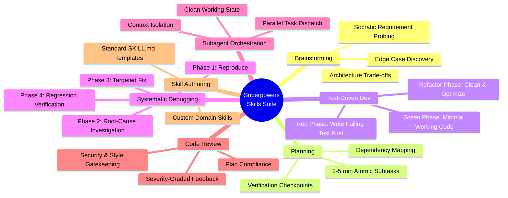
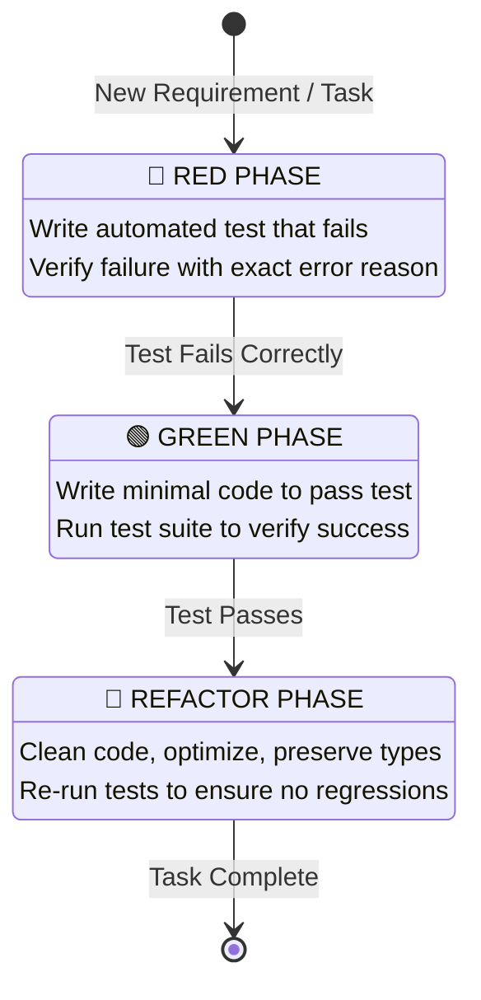
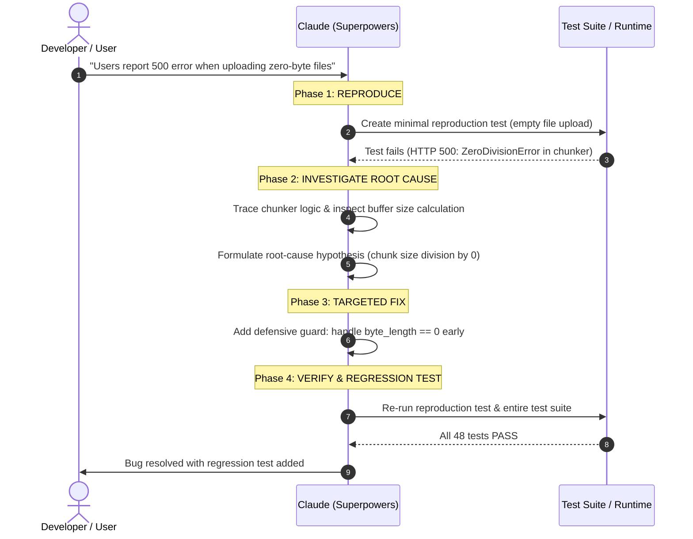
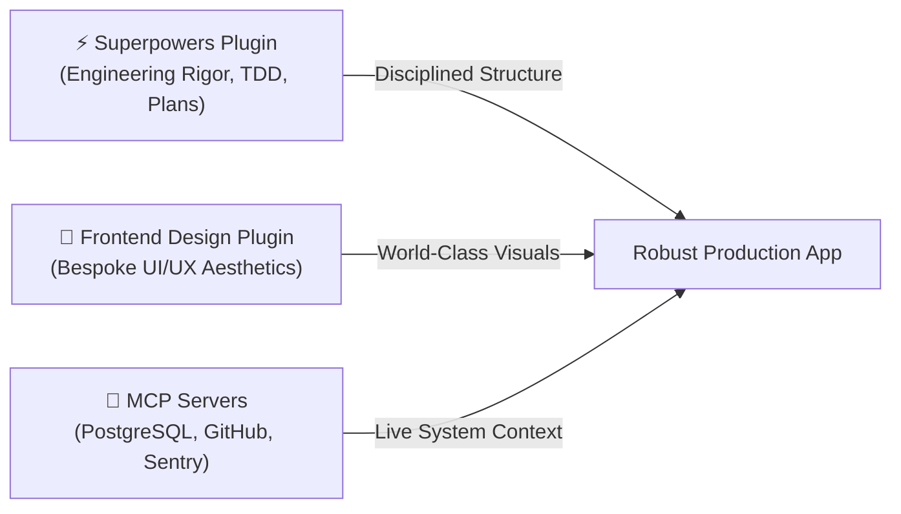

# Superpowers Plugin Guide for Claude Code

> **Plugin**: `superpowers`  
> **Author**: Jesse Vincent ([@obra](https://github.com/obra))  
> **Marketplace**: [https://claude.com/marketplace/plugins/superpowers](https://claude.com/marketplace/plugins/superpowers)  
> **Source Repository**: [github.com/obra/superpowers](https://github.com/obra/superpowers)  
> **Category**: Agentic Skills & Engineering Methodology Framework  

---

## 1. Overview & Core Philosophy

The **Superpowers** plugin is an open-source, agentic skills framework that transforms Claude Code from an ad-hoc *"vibe coding"* assistant into a **disciplined, professional software engineer**.

### The Problem: The Pitfalls of "Vibe Coding"
When AI coding agents are asked to implement features without constraints, they often:
- Rush to write implementation code before fully clarifying requirements or architecture.
- Produce superficial "happy-path" solutions that break on edge cases.
- Attempt massive multi-file changes in a single prompt, polluting token context and losing track of progress.
- Guess root causes during debugging, patching symptoms with random edits instead of isolating the underlying flaw.

### The Superpowers Solution: Engineering Discipline
Superpowers injects structured, non-negotiable software engineering processes into Claude Code via modular markdown skills (`SKILL.md`). The framework enforces two fundamental principles:

1. **"Evidence Over Claims"**: Claude must verify every step with failing and passing tests rather than assuming code works.
2. **"Systematic Over Ad-Hoc"**: Every modification follows a reproducible cycle: **Clarify ➔ Spec ➔ Plan ➔ Test ➔ Implement ➔ Review**.

```mermaid
flowchart TD
    subgraph VibeCoding ["Standard Vibe Coding (High Risk)"]
        V1["User Prompt: 'Add payment system'"] --> V2["Immediate Implementation"]
        V2 --> V3["Hidden Assumptions & Missing Edge Cases"]
        V3 --> V4["Fragile Code & Context Drift"]
    end

    subgraph SuperpowersFlow ["Superpowers Disciplined Workflow"]
        S1["User Prompt: 'Add payment system'"] --> S2["1. Brainstorm & Clarify Intent<br>(Socratic Probing, Spec Design)"]
        S2 --> S3["2. Granular Task Plan<br>(2-5 min atomic steps with dependencies)"]
        S3 --> S4["3. Test-Driven Development<br>(Red ➔ Green ➔ Refactor Cycle)"]
        S4 --> S5["4. Subagent Parallel Execution<br>(Fresh context windows for isolated tasks)"]
        S5 --> S6["5. Automated Code Review<br>(Quality & security gatekeeping)"]
        S6 --> S7["Robust, Production-Grade Deliverable"]
    end
```



---

## 2. Installation & Setup

You can install Superpowers into Claude Code using either the official marketplace, the author's community marketplace, or manual repository cloning.

### Option A: Official Marketplace Installation (Recommended)
Inside your terminal or active Claude Code session:

```bash
# In your terminal
claude plugin install superpowers@claude-plugins-official

# Or inside an active Claude Code interactive session:
/plugin install superpowers@claude-plugins-official
```

### Option B: Obra Community Marketplace
If installing directly from the author's plugin marketplace:

```text
/plugin marketplace add obra/superpowers-marketplace
/plugin install superpowers@superpowers-marketplace
```

### Option C: Manual Skill Installation
Clone the repository directly into your local Claude Code skills directory:

```bash
mkdir -p ~/.claude/skills
git clone https://github.com/obra/superpowers.git ~/.claude/skills/superpowers
```

### Verification & Reloading
After installation, verify that the skills are active:

```text
/plugin
/reload-plugins
/superpowers:help
```

---

## 3. The 7 Core Skills Breakdown

Superpowers equips Claude Code with seven structured skill modules that trigger automatically or via explicit slash commands.



---

### Skill 1: Brainstorming & Intent Clarification (`/superpowers:brainstorm`)
Before touching any code, Claude enters an investigative phase to clarify ambiguous requirements, uncover hidden constraints, and explore architecture options.

- **Socratic Inquiry**: Claude asks focused, multi-choice or open questions about scalability, tech stack constraints, and user experience.
- **Spec Generation**: Produces a lightweight technical specification defining inputs, outputs, error states, and data models.
- **Design Review**: Presents options with explicit trade-offs before locking down the design.

**Trigger Example:**
```text
/superpowers:brainstorm We need to add role-based access control (RBAC) with organization tenancy to our backend.
```

---

### Skill 2: Granular Planning (`/superpowers:write-plan`)
Converts an approved specification into an execution plan composed of small, verifiable tasks (each taking 2–5 minutes of agent work).

- **Atomic Task Breakdown**: No single task attempts too much logic at once.
- **Explicit Dependencies**: Tasks are ordered logically (e.g., database schema ➔ repositories ➔ business logic ➔ API endpoints ➔ UI).
- **Embedded Verification**: Every task includes an explicit command to verify success before proceeding.

**Plan Structure Example:**
```markdown
### Task 1: Create JWT Token Validator
- [ ] Write unit test: `tests/test_auth_token.py::test_expired_token_rejection`
- [ ] Implement `validate_jwt()` in `src/auth/tokens.py`
- [ ] Verify: `pytest tests/test_auth_token.py` (Must pass)
```

---

### Skill 3: Strict Test-Driven Development (`/superpowers:test-driven`)
Superpowers enforces the **Red-Green-Refactor** discipline, strictly prohibiting Claude from writing implementation code before a failing test exists.



1. **🔴 Red Phase**: Write a unit or integration test reproducing the desired behavior. Run the test and confirm it **fails for the expected reason**.
2. **🟢 Green Phase**: Write the cleanest, minimal implementation code required to make the test pass.
3. **🔵 Refactor Phase**: Clean up formatting, improve naming, remove duplication, and ensure all tests continue passing.

---

### Skill 4: Systematic 4-Phase Debugging (`/superpowers:debug-systematic`)
Stops the dangerous cycle of "guessing and patching". Claude systematically navigates four structured phases to permanently resolve bugs:



1. **Phase 1: Reproduce**: Create an automated test or reproduction script that reliably triggers the defect.
2. **Phase 2: Investigate**: Inspect logs, trace execution paths, and identify the root cause rather than patching symptoms.
3. **Phase 3: Targeted Fix**: Apply the minimal, correct fix directly addressing the root cause.
4. **Phase 4: Verify**: Re-run the reproduction test and the entire test suite to guarantee zero regressions.

---

### Skill 5: Subagent-Driven Parallel Development
When dealing with complex codebases, running all tasks in a single continuous conversation causes **context saturation** and hallucinations. Superpowers orchestrates subagents with isolated context windows.

- **Task Isolation**: Dispatches dedicated subagents for frontend, backend, test generation, and documentation.
- **Fresh Context Windows**: Each subagent starts with a clean prompt containing only the necessary file references and goals.
- **Result Aggregation**: The parent agent synthesizes the outputs and runs end-to-end verification.

---

### Skill 6: Automated Code Review & Quality Gatekeeping
Acts as an internal tech lead reviewing all staged changes before completion.

- **Severity Grading**:
  - 🔴 **Critical / Blocker**: Security vulnerability, memory leak, data corruption, broken tests.
  - 🟡 **Major**: Inadequate error handling, unhandled edge cases, performance bottleneck.
  - 🟢 **Minor / Polish**: Naming improvements, comment clarity, redundant imports.
- **Plan Compliance**: Checks that the code matches the original design spec and didn't introduce unrequested side effects.

---

### Skill 7: Skill Authoring Framework
Provides templates and guidelines for engineering teams to create project-specific custom skills adhering to the Superpowers standard.

- Standardized `SKILL.md` frontmatter.
- Clear trigger conditions and input/output parameters.
- Enforcement of safety checks and testing rules.

---

## 4. Slash Commands Quick Reference

| Slash Command | Purpose | When to Use |
| :--- | :--- | :--- |
| `/superpowers:brainstorm` | Initiate structured Socratic discovery | At the start of any new feature or architectural change. |
| `/superpowers:write-plan` | Generate granular, 2–5 min subtask plan | Once requirements are agreed upon, before writing code. |
| `/superpowers:test-driven` | Enforce Red-Green-Refactor TDD cycle | When implementing new business logic, utilities, or endpoints. |
| `/superpowers:debug-systematic` | 4-phase root cause debugging pipeline | Whenever investigating bugs, crashes, or failing tests. |
| `/superpowers:review` | Perform quality and security code review | Prior to staging git commits or merging pull requests. |
| `/superpowers:help` | Display active skills and usage guidelines | For quick syntax help and capability inspection. |

---

## 5. End-to-End Walkthrough Examples

### Example 1: Building a Rate Limiting Feature (TDD Workflow)

#### Step 1: Brainstorming
```text
> /superpowers:brainstorm
  We need an in-memory token-bucket rate limiter for our Express.js API.
  Must support 100 requests per minute per IP, with Redis backend optional for future.
```
*Claude responds with clarifying questions on key expiration, CIDR block handling, and HTTP headers (`RateLimit-Limit`, `RateLimit-Remaining`).*

#### Step 2: Implementation Plan
```markdown
### Rate Limiter Implementation Plan
1. [ ] Test: `test/rateLimiter.test.ts` (Should reject 101st request with HTTP 429)
2. [ ] Core: `src/middleware/rateLimiter.ts` (Token bucket logic)
3. [ ] Headers: Add standard IETF rate-limit response headers
4. [ ] Verification: `npm test`
```

#### Step 3: TDD Execution
```typescript
// 1. RED: Write failing test in test/rateLimiter.test.ts
describe('RateLimiter Middleware', () => {
  it('should return 429 Too Many Requests when limit exceeded', async () => {
    const app = createTestApp({ max: 5, windowMs: 60000 });
    for (let i = 0; i < 5; i++) {
      const res = await request(app).get('/api/data');
      expect(res.status).toBe(200);
    }
    const blockedRes = await request(app).get('/api/data');
    expect(blockedRes.status).toBe(429);
    expect(blockedRes.header['retry-after']).toBeDefined();
  });
});
```
*Claude runs `npm test` ➔ Confirms test fails with `Cannot find module './rateLimiter'`.*

```typescript
// 2. GREEN: Implement minimal working solution in src/middleware/rateLimiter.ts
export function rateLimiter(options: { max: number; windowMs: number }) {
  const hits = new Map<string, { count: number; resetTime: number }>();
  return (req, res, next) => {
    const ip = req.ip;
    const now = Date.now();
    const record = hits.get(ip);

    if (!record || now > record.resetTime) {
      hits.set(ip, { count: 1, resetTime: now + options.windowMs });
      return next();
    }

    if (record.count >= options.max) {
      res.setHeader('Retry-After', Math.ceil((record.resetTime - now) / 1000));
      return res.status(429).json({ error: 'Too many requests' });
    }

    record.count++;
    next();
  };
}
```
*Claude runs `npm test` ➔ All tests pass!*

---

### Example 2: Resolving a Deadlock Bug (Systematic Debugging)

```text
> /superpowers:debug-systematic
  PostgreSQL connection pool exhausted under concurrent load during checkout.
```

1. **Reproduce**: Claude creates `tests/load/concurrency.spec.ts` simulating 50 concurrent transactions without releasing pool clients on error.
2. **Investigate**: Identifies missing `finally { client.release(); }` inside database transaction catch block.
3. **Fix**: Adds RAII/try-finally connection release wrapper.
4. **Verify**: Runs concurrent load test ➔ 50/50 transactions succeed without pool starvation.

---

## 6. Combining Superpowers with Other Plugins

Superpowers forms a powerful triad when used alongside complementary Claude Code plugins:



- **Superpowers + Frontend Design**: Superpowers creates the structural test cases and component contracts, while `frontend-design` generates stunning, distinctive UI styling (e.g., neo-brutalist, luxury editorial).
- **Superpowers + MCP Servers**: Superpowers uses live database schemas (via PostgreSQL MCP) and real error telemetry (via Sentry MCP) during the systematic debugging phase.

---

## 7. Best Practices for Developers

1. **Never Skip the Red Phase**: Always confirm that a test actually fails before writing implementation code. A test that passes without implementation code is invalid.
2. **Keep Tasks Atomic (2–5 Minutes)**: If a subtask feels complex, use `/superpowers:write-plan` to break it into smaller subtasks.
3. **Leverage Subagents for Context Hygiene**: When tackling multi-domain features (e.g., API + React UI + Database Migrations), instruct Claude to delegate subtasks to fresh subagents.
4. **Run Regular Code Reviews**: Use `/superpowers:review` before finalizing pull requests to catch latent security, typing, or performance oversights.
