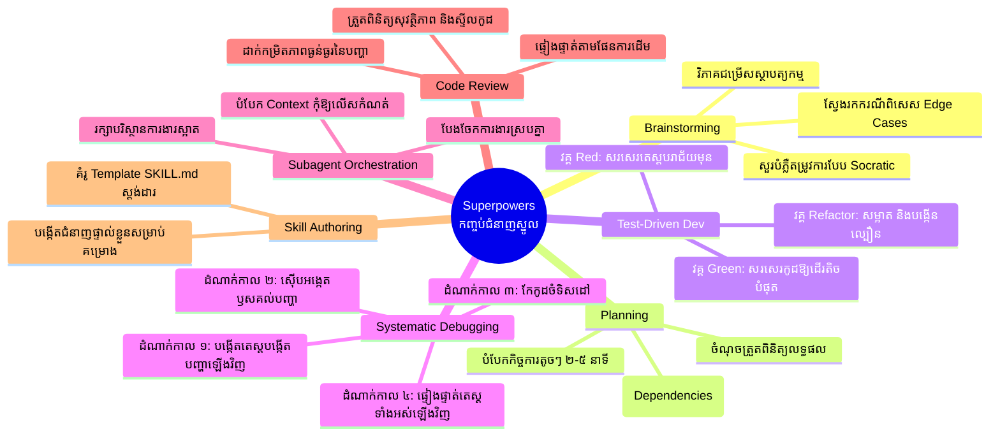
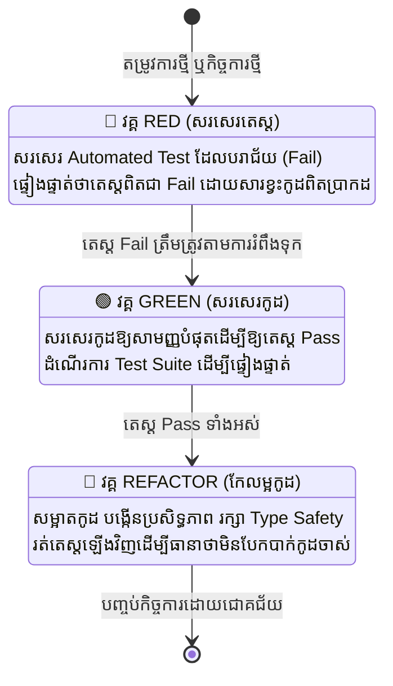
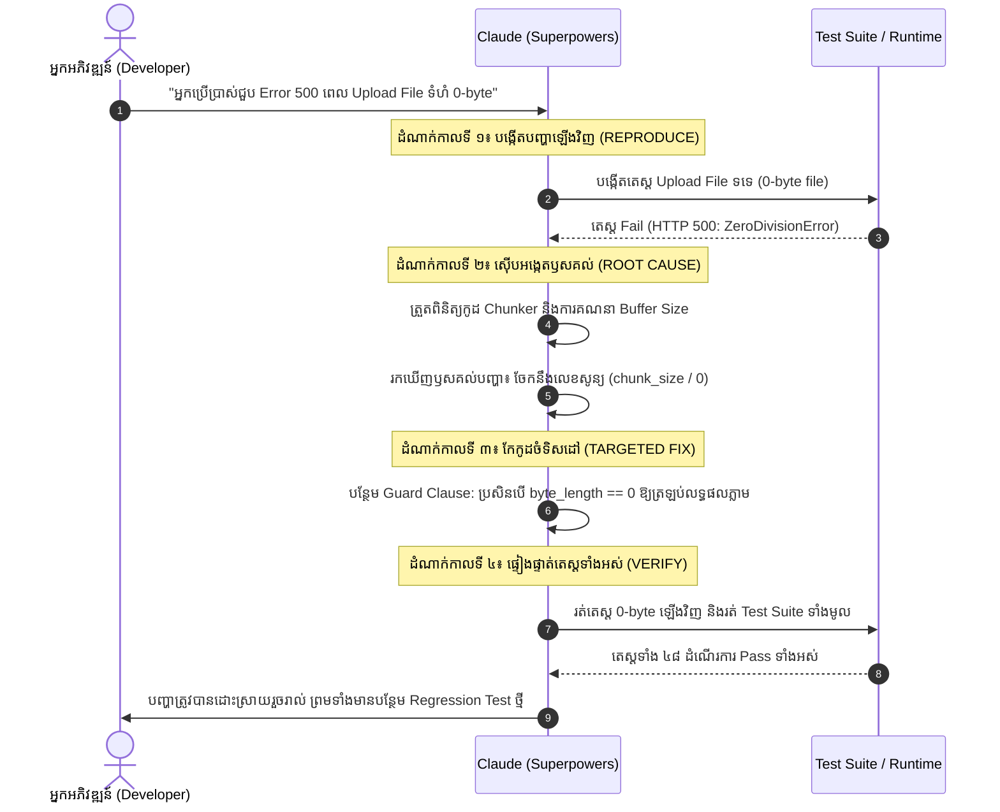
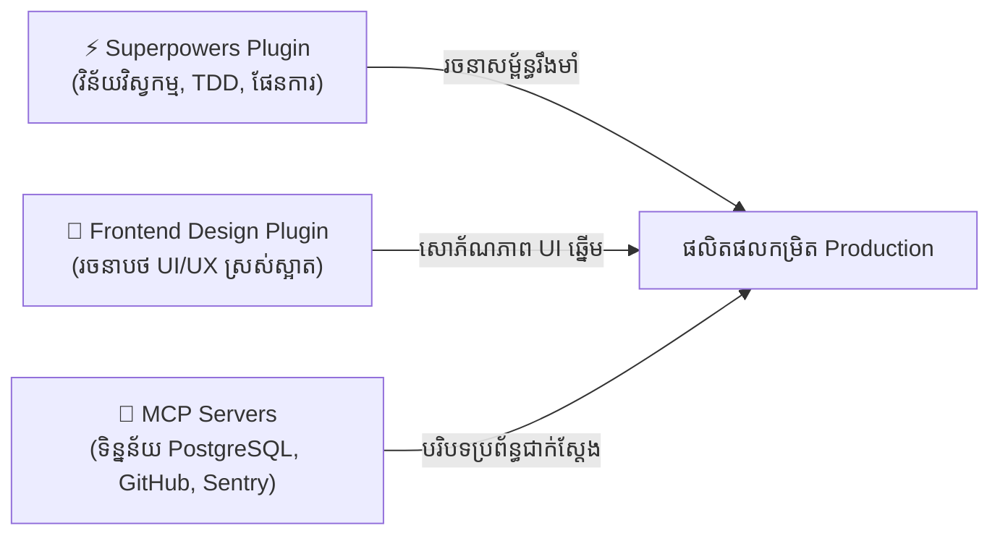

# សៀវភៅណែនាំ Superpowers Plugin សម្រាប់ Claude Code (ភាសាខ្មែរ)

> **Plugin**: `superpowers`  
> **អ្នកបង្កើត**: Jesse Vincent ([@obra](https://github.com/obra))  
> **Marketplace ផ្លូវការ**: [https://claude.com/marketplace/plugins/superpowers](https://claude.com/marketplace/plugins/superpowers)  
> **Source Code**: [github.com/obra/superpowers](https://github.com/obra/superpowers)  
> **ប្រភេទ**: ក្របខ័ណ្ឌជំនាញវិស្វកម្មភ្នាក់ងារ AI (Agentic Skills & Engineering Framework)  

---

## ១. សេចក្តីផ្តើម និងទស្សនវិជ្ជាស្នូល (Overview & Philosophy)

**Superpowers Plugin** គឺជាប្រព័ន្ធជំនាញបែប Agentic Skills បើកចំហ (Open-source) ដែលផ្លាស់ប្តូរ Claude Code ពីជំនួយការសរសេរកូដតាមការស្មាន (ហៅថា *"Vibe Coding"*) ទៅជា **វិស្វករកម្មវិធីកម្រិតវិជ្ជាជីវៈដែលមានវិន័យ និងដំណើរការការងារច្បាស់លាស់**។

### បញ្ហាប្រឈមនៃ "Vibe Coding"
នៅពេលដែលភ្នាក់ងារ AI ត្រូវបានបញ្ជាឱ្យបង្កើត Feature ដោយគ្មានក្របខ័ណ្ឌវិន័យ AI តែងតែជួបបញ្ហាដូចជា៖
- ប្រញាប់ប្រញាល់សរសេរកូដភ្លាមៗ ដោយមិនបានស្វែងយល់ឱ្យស៊ីជម្រៅពីតម្រូវការ ឬស្ថាបត្យកម្មប្រព័ន្ធ។
- បង្កើតកូដដែលដំណើរការតែលើករណីសាមញ្ញ (Happy path) ប៉ុន្តែគាំង ឬ Error នៅពេលជួបករណីពិសេស (Edge cases)។
- កែប្រែ File ច្រើនក្នុងពេលតែមួយ ដែលបណ្តាលឱ្យលើស Context Window (Token bloat) និងវង្វេងបាត់បង់ទិសដៅ។
- ស្មានមូលហេតុពេលជួប Bug ដោយកែកូដបែបបិទបាំងរោគសញ្ញា (Symptom patching) ជំនួសឱ្យការដោះស្រាយដល់ឫសគល់។

### ដំណោះស្រាយពី Superpowers៖ វិន័យវិស្វកម្មកម្មវិធី
Superpowers បន្ថែមជំនាញច្បាស់លាស់ (Modular Markdown Skills `SKILL.md`) ទៅកាន់ Claude Code ដោយអនុវត្តតាមគោលការណ៍គ្រឹះចំនួនពីរ៖

1. **"ភស្តុតាងសំខាន់ជាងការសន្និដ្ឋាន" (Evidence Over Claims)**៖ Claude ត្រូវតែផ្ទៀងផ្ទាត់រាល់ជំហានតាមរយៈការធ្វើតេស្តស្វ័យប្រវត្ត (Automated Tests) ដែលបរាជ័យជាមុន រួចទើបឆ្លងកាត់ មិនមែនស្មានថាកូដដំណើរការនោះទេ។
2. **"ការអនុវត្តតាមប្រព័ន្ធជាជាងការធ្វើតាមចិត្ត" (Systematic Over Ad-Hoc)**៖ រាល់ការកែប្រែកូដត្រូវតែឆ្លងកាត់វដ្ត ៦ ដំណាក់កាល៖ **បំភ្លឺតម្រូវការ ➔ កំណត់លក្ខណៈបច្ចេកទេស (Spec) ➔ រៀបចំផែនការ ➔ សរសេរតេស្ត ➔ សរសេរកូដ ➔ ត្រួតពិនិត្យ (Review)**។

```mermaid
flowchart TD
    subgraph VibeCoding ["Vibe Coding ធម្មតា (ហានិភ័យខ្ពស់)"]
        V1["សំណើ: 'បន្ថែមប្រព័ន្ធទូទាត់ប្រាក់'"] --> V2["សរសេរកូដភ្លាមៗដោយគ្មានផែនការ"]
        V2 --> V3["សន្មតដោយខ្លួនឯង & ខកខានករណីពិសេស Edge Cases"]
        V3 --> V4["កូដងាយខូច & វង្វេងបាត់បង់ Context"]
    end

    subgraph SuperpowersFlow ["ដំណើរការការងារ Superpowers (មានវិន័យខ្ពស់)"]
        S1["សំណើ: 'បន្ថែមប្រព័ន្ធទូទាត់ប្រាក់'"] --> S2["១. សួរនាំ និងបំភ្លឺតម្រូវការ<br>(Brainstorming & Spec Design)"]
        S2 --> S3["២. បំបែកផែនការការងារលម្អិត<br>(កិច្ចការតូចៗ ២-៥ នាទី និងលំដាប់លំដោយ)"]
        S3 --> S4["៣. ការអភិវឌ្ឍដោយផ្អែកលើតេស្ត (TDD)<br>(វដ្ត Red ➔ Green ➔ Refactor)"]
        S4 --> S5["៤. ដំណើរការភ្នាក់ងាររង Subagents<br>(បំបែក Context សម្រាប់កិច្ចការស្របគ្នា)"]
        S5 --> S6["៥. ត្រួតពិនិត្យកូដស្វ័យប្រវត្ត (Code Review)<br>(ពិនិត្យសុវត្ថិភាព គុណភាព និងការអនុលោមតាមផែនការ)"]
        S6 --> S7["លទ្ធផលកូដរឹងមាំ កម្រិត Production ស្ដង់ដារ"]
    end
```



---

## ២. របៀបដំឡើង និងការកំណត់រចនាសម្ព័ន្ធ (Installation & Setup)

អ្នកអាចដំឡើង Superpowers ទៅក្នុង Claude Code តាមវិធីសាស្រ្តចំនួន ៣៖

### វិធីទី ១៖ ដំឡើងតាម Marketplace ផ្លូវការ (ណែនាំបំផុត)
ដំណើរការពាក្យបញ្ជាក្នុង Terminal ឬនៅក្នុងផ្ទាំងសន្ទនា Claude Code៖

```bash
# ដំឡើងតាម Terminal
claude plugin install superpowers@claude-plugins-official

# ឬវាយពាក្យបញ្ជានៅក្នុង Claude Code Session ផ្ទាល់:
/plugin install superpowers@claude-plugins-official
```

### វិធីទី ២៖ ដំឡើងតាម Marketplace របស់ Obra (Community)
ប្រសិនបើចង់ដំឡើងពី Marketplace ផ្ទាល់របស់អ្នកបង្កើត Plugin៖

```text
/plugin marketplace add obra/superpowers-marketplace
/plugin install superpowers@superpowers-marketplace
```

### វិធីទី ៣៖ ដំឡើងដោយផ្ទាល់តាមរយៈ Git Clone (Manual Installation)
ទាញយក Source Code ដាក់ចូលទៅក្នុង Folder ជំនាញរបស់ Claude Code៖

```bash
mkdir -p ~/.claude/skills
git clone https://github.com/obra/superpowers.git ~/.claude/skills/superpowers
```

### ការផ្ទៀងផ្ទាត់ និងដំណើរការឡើងវិញ (Verify & Reload)
ក្រោយពេលដំឡើងរួច សូមពិនិត្យមើល Plugin និងជំនាញដែលកំពុងដំណើរការ៖

```text
/plugin
/reload-plugins
/superpowers:help
```

---

## ៣. ការវិភាគស៊ីជម្រៅលើជំនាញស្នូលទាំង ៧ (7 Core Skills)

Superpowers បំពាក់នូវជំនាញចំនួន ៧ ដែលដំណើរការដោយស្វ័យប្រវត្តទៅតាមបរិបទ ឬតាមរយៈ Slash Commands៖



---

### ជំនាញទី ១៖ ការពិគ្រោះយោបល់ និងបំភ្លឺតម្រូវការ (`/superpowers:brainstorm`)
មុនពេលប៉ះពាល់ដល់កូដ Claude នឹងចូលទៅក្នុងដំណាក់កាលស៊ើបអង្កេត ដើម្បីបំភ្លឺចំណុចស្រពិចស្រពិល រកមើលឧបសគ្គលាក់កំបាំង និងរៀបចំស្ថាបត្យកម្ម៖

- **ការសួរបែប Socratic**៖ សួរសំណួរច្បាស់លាស់អំពីទំហំផ្ទុក (Scalability), បច្ចេកវិទ្យាប្រើប្រាស់ និងបទពិសោធន៍អ្នកប្រើប្រាស់។
- **ការបង្កើត Spec**៖ សរសេរឯកសារលក្ខណៈបច្ចេកទេសសង្ខេបដែលបញ្ជាក់ពី Input, Output, Error States និង Data Models។
- **ការវាយតម្លៃជម្រើស**៖ បង្ហាញជម្រើសស្ថាបត្យកម្មផ្សេងៗព្រមទាំងចំណុចល្អ និងចំណុចខ្សោយ (Trade-offs) មុនសម្រេចចិត្ត។

**ឧទាហរណ៍នៃការប្រើប្រាស់៖**
```text
/superpowers:brainstorm យើងត្រូវការបន្ថែមមុខងារ Role-Based Access Control (RBAC) ជាមួយ Multi-tenancy លើ Backend របស់យើង។
```

---

### ជំនាញទី ២៖ ការរៀបចំផែនការលម្អិតកម្រិតអាតូមិក (`/superpowers:write-plan`)
បំប្លែង Specification ដែលបានអនុម័តរួចឱ្យទៅជាផែនការសកម្មភាពជាក់ស្តែង ដោយបំបែកជាកិច្ចការតូចៗ (កិច្ចការនីមួយៗប្រើពេល ២ ទៅ ៥ នាទី)៖

- **ការបំបែកជាកិច្ចការតូចៗ (Atomic Tasks)**៖ មិនសរសេរកូដច្រើនស្មុគស្មាញក្នុងជំហានតែមួយឡើយ។
- **លំដាប់លំដោយច្បាស់លាស់ (Explicit Dependencies)**៖ រៀបចំកិច្ចការតាមលំដាប់ (ឧ. DB Schema ➔ Repositories ➔ Business Logic ➔ API Endpoints ➔ UI)។
- **ការបញ្ជាក់ការផ្ទៀងផ្ទាត់ (Embedded Verification)**៖ រាល់កិច្ចការទាំងអស់ត្រូវតែមានពាក្យបញ្ជា Test ឬ Check ច្បាស់លាស់មុននឹងបន្តទៅមុខ។

**រចនាសម្ព័ន្ធផែនការគំរូ៖**
```markdown
### កិច្ចការទី ១៖ បង្កើតប្រព័ន្ធផ្ទៀងផ្ទាត់ JWT Token
- [ ] សរសេរ Unit Test៖ `tests/test_auth_token.py::test_expired_token_rejection`
- [ ] សរសេរ Function `validate_jwt()` នៅក្នុង `src/auth/tokens.py`
- [ ] ផ្ទៀងផ្ទាត់៖ `pytest tests/test_auth_token.py` (ត្រូវតែ Pass)
```

---

### ជំនាញទី ៣៖ ការអភិវឌ្ឍដោយផ្អែកលើការធ្វើតេស្តជាមុន (`/superpowers:test-driven`)
Superpowers អនុវត្តវិន័យ **Red-Green-Refactor** យ៉ាងតឹងរ៉ឹង ដោយហាមដាច់ខាតមិនឱ្យ Claude សរសេរកូដកម្មវិធីឡើយ ដរាបណាមិនទាន់មាន Test ដែល Fail ជាមុនសិន។



1. **🔴 វគ្គ Red**៖ សរសេរ Unit Test ឬ Integration Test ដើម្បីតំណាងឱ្យមុខងារថ្មី។ រត់តេស្តនោះ ហើយបញ្ជាក់ថាវា **បរាជ័យចំមូលហេតុពិតប្រាកដ**។
2. **🟢 វគ្គ Green**៖ សរសេរកូដកម្មវិធីឱ្យខ្លី និងចំគោលដៅបំផុតដើម្បីឱ្យ Test នោះប្រែជា Pass។
3. **🔵 វគ្គ Refactor**៖ កែសម្រួលរចនាសម្ព័ន្ធកូដ សម្អាតឈ្មោះអថេរ និងបង្កើនល្បឿនដំណើរការ ដោយនៅតែរក្សាឱ្យតេស្តទាំងអស់ Pass ដដែល។

---

### ជំនាញទី ៤៖ ការដោះស្រាយ Bug ជាប្រព័ន្ធ ៤ ដំណាក់កាល (`/superpowers:debug-systematic`)
បញ្ឈប់ទម្លាប់គ្រោះថ្នាក់នៃការ "ស្មានហើយកែកូដសាកល្បង"។ Claude នឹងឆ្លងកាត់ ៤ ដំណាក់កាលដើម្បីដោះស្រាយ Bug ឱ្យដាច់ស្រឡះ៖



1. **ដំណាក់កាលទី ១ (Reproduce)**៖ បង្កើត Automated Test ឬ Script ដើម្បីបង្កើតកំហុសនោះឡើងវិញឱ្យប្រាកដប្រជា។
2. **ដំណាក់កាលទី ២ (Investigate)**៖ ពិនិត្យ Log, តាមដានដំណើរការកូដ (Trace Execution) និងស្វែងរកឫសគល់ពិតប្រាកដ។
3. **ដំណាក់កាលទី ៣ (Targeted Fix)**៖ កែកូដឱ្យចំចំណុចខ្វះខាត ដោយមិនប៉ះពាល់ដល់ផ្នែកផ្សេង។
4. **ដំណាក់កាលទី ៤ (Verify)**៖ រត់តេស្តបង្កើតបញ្ហានោះឡើងវិញ និងរត់តេស្តទាំងអស់ក្នុងគម្រោង ដើម្បីធានាថាមិនប៉ះពាល់មុខងារចាស់ (Zero Regressions)។

---

### ជំនាញទី ៥៖ ការសម្របសម្រួលភ្នាក់ងាររងស្របគ្នា (Subagent Orchestration)
សម្រាប់គម្រោងធំៗ ការដំណើរការកិច្ចការទាំងអស់ក្នុង Session តែមួយ ធ្វើឱ្យខាតបង់ Context Window និងនាំឱ្យ AI ចាប់ផ្តើមភ្លេចភ្លាំង។ Superpowers បែងចែកភ្នាក់ងាររង (Subagents) ដែលមាន Context ស្អាតដាច់ដោយឡែកពីគ្នា៖

- **ការបំបែកកិច្ចការ (Task Isolation)**៖ បង្កើត Subagent មួយសម្រាប់ Frontend, មួយទៀតសម្រាប់ Backend, មួយសម្រាប់ Unit Tests និងមួយសម្រាប់ Documentation។
- **Context ស្រស់ថ្លា (Fresh Context)**៖ Subagent នីមួយៗចាប់ផ្តើមជាមួយនឹងសេចក្តីណែនាំ និង File ដែលពាក់ព័ន្ធផ្ទាល់តែប៉ុណ្ណោះ។
- **ការបូកសរុបលទ្ធផល (Aggregation)**៖ ភ្នាក់ងារមេ (Parent Agent) ធ្វើការបូកបញ្ចូលលទ្ធផល និងរត់តេស្តសរុបចុងក្រោយ។

---

### ជំនាញទី ៦៖ ការត្រួតពិនិត្យគុណភាពកូដស្វ័យប្រវត្ត (Code Review)
ដើរតួជា Tech Lead ផ្ទៃក្នុង ដើម្បីពិនិត្យមើលកូដដែលបានកែប្រែទាំងអស់មុនពេល Commit ឬ Merge៖

- **ការដាក់កម្រិតភាពធ្ងន់ធ្ងរ (Severity Levels)**៖
  - 🔴 **Critical / Blocker**៖ បញ្ហាសុវត្ថិភាព (Security Vulnerabilities), ការលេចធ្លាយ Memory, ការបាត់បង់ទិន្នន័យ, ឬតេស្តខូច។
  - 🟡 **Major**៖ ការគ្រប់គ្រង Error មិនបានល្អ, ខកខានករណី Edge Cases, ឬប៉ះពាល់ដល់ល្បឿនដំណើរការ។
  - 🟢 **Minor / Polish**៖ ការកែលម្អឈ្មោះអថេរ, ភាពច្បាស់លាស់នៃ Comment, ឬការលុប Import ដែលមិនប្រើ។
- **ការអនុលោមតាមផែនការ (Plan Compliance)**៖ ពិនិត្យមើលថាកូដពិតជាបានបំពេញតាម Spec ដើម និងមិនបានបន្ថែមមុខងារក្រៅផែនការ។

---

### ជំនាញទី ៧៖ ការបង្កើតជំនាញផ្ទាល់ខ្លួន (Skill Authoring)
ផ្តល់នូវគំរូ (Template) និងស្តង់ដារសម្រាប់ក្រុមការងារក្នុងការបង្កើតជំនាញជាក់លាក់សម្រាប់គម្រោងរបស់ខ្លួន ស្របតាមទម្រង់ Superpowers Standard (`SKILL.md`)។

---

## ៤. តារាងសង្ខេបពាក្យបញ្ជាផ្លូវកាត់ (Slash Commands Reference)

| ពាក្យបញ្ជា | គោលបំណង | ពេលណាត្រូវប្រើ |
| :--- | :--- | :--- |
| `/superpowers:brainstorm` | ចាប់ផ្តើមការសួរដេញដោល និងបំភ្លឺតម្រូវការ | ពេលចាប់ផ្តើមបង្កើត Feature ថ្មី ឬប្តូរស្ថាបត្យកម្ម |
| `/superpowers:write-plan` | បង្កើតផែនការកិច្ចការតូចៗ (២-៥ នាទី) | ពេលបំភ្លឺតម្រូវការរួចរាល់ មុននឹងសរសេរកូដ |
| `/superpowers:test-driven` | អនុវត្តវដ្ត TDD (Red-Green-Refactor) | ពេលសរសេរ Logic ថ្មី, Helper Functions ឬ API |
| `/superpowers:debug-systematic` | ដោះស្រាយ Bug តាមប្រព័ន្ធ ៤ ដំណាក់កាល | ពេលជួបបញ្ហា Crash, Error ឬតេស្តមិន Pass |
| `/superpowers:review` | ត្រួតពិនិត្យកូដ និងវាយតម្លៃសុវត្ថិភាព | មុនពេល Git Commit ឬបង្កើត Pull Request |
| `/superpowers:help` | បង្ហាញជំនាញទាំងអស់ និងរបៀបប្រើប្រាស់ | សម្រាប់មើលជំនួយ និងស្វែងរកពាក្យបញ្ជា |

---

## ៥. ឧទាហរណ៍ជាក់ស្តែងនៃការអនុវត្ត (Real-World Examples)

### ឧទាហរណ៍ទី ១៖ ការបង្កើតមុខងារ Rate Limiting ជាមួយ TDD

#### ជំហានទី ១៖ បំភ្លឺតម្រូវការ (Brainstorming)
```text
> /superpowers:brainstorm
  យើងចង់បង្កើត In-memory Token Bucket Rate Limiter សម្រាប់ Express.js API។
  កំណត់អតិបរមា ១០០ Requests ក្នុង ១ នាទីសម្រាប់ IP មួយ។
```
*Claude នឹងសួរនាំអំពីការកំណត់ Header ដូចជា `RateLimit-Limit`, `RateLimit-Remaining` និងការគ្រប់គ្រង IP Reverse Proxy។*

#### ជំហានទី ២៖ រៀបចំផែនការ (Implementation Plan)
```markdown
### ផែនការបង្កើត Rate Limiter
1. [ ] សរសេរ Test៖ `test/rateLimiter.test.ts` (បដិសេធ Request ទី ១០១ ជាមួយកូដ HTTP 429)
2. [ ] សរសេរ Logic ស្នូល៖ `src/middleware/rateLimiter.ts`
3. [ ] បន្ថែម HTTP Headers តាមស្ដង់ដារ IETF
4. [ ] ផ្ទៀងផ្ទាត់៖ `npm test`
```

#### ជំហានទី ៣៖ អនុវត្តតាម TDD
```typescript
// 1. វគ្គ RED: សរសេរ Test ដែលបរាជ័យនៅក្នុង test/rateLimiter.test.ts
describe('RateLimiter Middleware', () => {
  it('ត្រូវត្រឡប់ 429 Too Many Requests នៅពេលលើសកំណត់', async () => {
    const app = createTestApp({ max: 5, windowMs: 60000 });
    for (let i = 0; i < 5; i++) {
      const res = await request(app).get('/api/data');
      expect(res.status).toBe(200);
    }
    const blockedRes = await request(app).get('/api/data');
    expect(blockedRes.status).toBe(429);
    expect(blockedRes.header['retry-after']).toBeDefined();
  });
});
```
*Claude រត់ពាក្យបញ្ជា `npm test` ➔ ទទួលបានលទ្ធផល Fail ត្រឹមត្រូវដោយសារមិនទាន់មាន File កូដ។*

```typescript
// 2. វគ្គ GREEN: សរសេរកូដឱ្យដើរសាមញ្ញបំផុតក្នុង src/middleware/rateLimiter.ts
export function rateLimiter(options: { max: number; windowMs: number }) {
  const hits = new Map<string, { count: number; resetTime: number }>();
  return (req, res, next) => {
    const ip = req.ip;
    const now = Date.now();
    const record = hits.get(ip);

    if (!record || now > record.resetTime) {
      hits.set(ip, { count: 1, resetTime: now + options.windowMs });
      return next();
    }

    if (record.count >= options.max) {
      res.setHeader('Retry-After', Math.ceil((record.resetTime - now) / 1000));
      return res.status(429).json({ error: 'Too many requests' });
    }

    record.count++;
    next();
  };
}
```
*Claude រត់ពាក្យបញ្ជា `npm test` ម្តងទៀត ➔ តេស្ត Pass ទាំងអស់ ១០០%!*

---

## ៦. ការរួមផ្សំ Superpowers ជាមួយ Plugins ដទៃទៀត

Superpowers ដំណើរការយ៉ាងល្អប្រសើរនៅពេលប្រើរួមគ្នាជាមួយ Plugins ផ្សេងៗ៖



- **Superpowers + Frontend Design**៖ Superpowers ធានាភាពត្រឹមត្រូវនៃ Test, Logic និង State Management ខណៈដែល `frontend-design` ធានារូបរាង UI/UX ស្រស់ស្អាត ប្លែកភ្នែក មិនដដែលៗ។
- **Superpowers + MCP Servers**៖ Superpowers អាចទាញយក Schema ផ្ទាល់ពី Database MCP និង Error Logs ពី Sentry MCP មកប្រើក្នុងដំណើរការ Systematic Debugging។

---

## ៧. គន្លឹះ និងការអនុវត្តល្អៗ (Best Practices)

1. **កុំរំលងវគ្គ RED ជាដាច់ខាត**៖ ត្រូវតែប្រាកដថាតេស្តពិតជា Fail ដោយសារកូដមិនទាន់មាន មុននឹងចាប់ផ្តើមសរសេរកូដ។
2. **រក្សាកិច្ចការឱ្យនៅតូចល្មម (២ ទៅ ៥ នាទី)**៖ ប្រសិនបើកិច្ចការស្មុគស្មាញ ត្រូវប្រើ `/superpowers:write-plan` ដើម្បីបំបែកជាកិច្ចការតូចៗបន្ថែមទៀត។
3. **ប្រើប្រាស់ Subagents ដើម្បីរក្សា Context**៖ នៅពេលធ្វើការលើ Feature ដែលមានទាំង Frontend, Backend និង Database ចូរឱ្យ Claude បែងចែកការងារទៅកាន់ Subagents ដាច់ដោយឡែកពីគ្នា។
4. **ធ្វើ Code Review មុន Commit**៖ ដំណើរការ `/superpowers:review` ជានិច្ច ដើម្បីទប់ស្កាត់ចន្លោះប្រហោងសុវត្ថិភាព ឬបញ្ហា Performance មុនពេល Push កូដចូល Repository។
